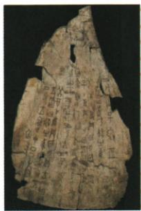

## 讲解

### 是什么

甲骨文是商朝人刻在龟甲、兽骨上、记录占卜等情况的文字。原书说其涉及祭祀、战争、农牧业、官制、刑法、医药、天文历法等，已具汉字基本结构，是目前已发现古代文字中年代最早、体系较完整的成熟文字；我国有文字可考历史从商朝开始。限定的是现有发现及文字材料，不是人类活动的全部起点。

### 怎么来的

占卜与政治、生产活动相接，文字记录使具体事项留下可供后人识读的材料；内容涉及多方面，因此能研究商代生活与治理。成熟文字不只是一个图案或记号，而需有较完整的表达体系，能记录不同事项。不能每发现一个单独刻画符号就立即宣称发现另一套更早成熟文字。

考古器物与文字材料都能研究过去，但提供的信息类型不同。遗址、工具、墓葬能帮助认识生产、生活和等级，铭文可提供事件、名称或记时信息；两类相接更有依据。商朝文字可考这一结论因此不否定夏和史前的考古研究，也不否定汉字可能经历更早形成过程；它说明可考历史的文字证据现状。

### 什么时候能用

题目明确问目前有文字可考历史起点，回答商；问文明起源、早期国家、古人类则另按概念和证据判断。判断文字历史价值时要看内容、年代和释读，不说一片甲骨已完整覆盖整个朝代；文字刻在骨上也不能改叫骨器一定用于农耕。

## 例题

**原资料设问（H8-S04）：**目前所知，我国有文字可考的历史从哪一朝代开始？

**原答案：**商朝。

**完整解析补写：**本题限定“目前所知”“有文字可考”，结合商朝甲骨文已是成熟文字体系，回答商朝。它讨论历史研究可依据的文字材料，不是问中国人类活动、农业或文明何时开始。商以前仍能由遗址、器物等材料研究，因此不能将答案扩大成商以前没有历史。

## 易错

- 把有文字可考历史等同全部中国历史：史前仍有实物等证据。
- 见图案就称成熟文字：体系和表达能力要有依据。
- 认为甲骨只记战争：原书列有多种内容。

### 来源定位

- H8-S02：full.md（历史扫描分册1-50），L4809–L4823，甲骨文与青铜器、金文；22fce0ae-e244-4784-abd1-7e1ac2556947_origin.pdf，实际PDF第45页。
- H8-S04：full.md（历史扫描分册1-50），L4829–L4843，刻字牛骨与有文字可考历史设问原答；22fce0ae-e244-4784-abd1-7e1ac2556947_origin.pdf，实际PDF第45页。
