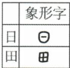
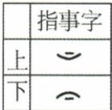
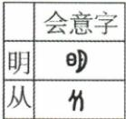
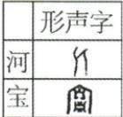

## 讲解

### 是什么

原书列象形、指事、会意、形声四种造字方法。象形取物体外形，指事用指示符号表示概念，会意组合已有字形表达新意义，形声结合表义类别与读音线索。方法描述字形怎样表示意义或声音，不是给字的书写顺序，也不是说一个字必须经四步依次变成。

### 怎么来的

可见物体容易用外形表示，如日、田；抽象位置无法简单画出独立物体，便可用标记与位置关系表示上、下。若概念涉及关系或组合意义，如两个人形相随，组合字形便能表达“从”。形声把意义类别与读音相配，能够扩展文字表达，解释原书说现代许多汉字是形声字。

四类的区别在表意与表音的方式，而非字形画得漂亮与否。观察古字形要按时代材料与释文，今天部件外形和读音可能已有变化，因此不能把现代字的读音相同视为古代声符完全相同的充分证据。形声含表义信息，不等于仅表音；会意组合意义，也不等于每个组合中所有部件都只靠现代字义解释。

### 什么时候能用

题目给古字形与释文，先说明各部件表示什么，再判断组合的意义或造字方式。没有古字形和释读依据时，不从记忆编画甲骨字。原表四类是本课的比较范围，不能说汉字历史中只有这四种讨论方式，或所有个别字的分类永远无争议。

## 例题

**原资料造字方法与字形（H8-S08）：**

|方法|原说明|原字形|
|---|---|---|
|象形|最原始的造字方法，用图形、线条勾画物体的外形特征||
|指事|用指示性符号表示事物或概念，如“上”，长横代表水平线，短横表示以上||
|会意|两个或两个以上独体字结合表示新意义，如“从”，两个人形表示跟从||
|形声|声符注音，一个字表示类别，组成新字；能造大量文字，现代汉字很多是形声字||

**材料解析补写：**按原形看表示关系：日、田取物形；上、下借相对位置指示概念；从组合两个人形表示关系；形声要区别表义类别与读音线索。原表把若干古字形配在方法旁，不能只按今天楷书的部件去猜；本课也没有提供每个古字的全部演变谱系，个别字的历时结构须避免由现代读音直接反推。

## 易错

- 将会意说成只描画一件物体：会意重在组合意义。
- 将形声说成部件全表义：需要区分声符和表义类别。
- 用现代部件形状替代原古字形：会丢掉题目证据。

### 来源定位

- H8-S08：full.md（历史扫描分册1-50），L4890–L4894，甲骨造字四种方法及原字形；22fce0ae-e244-4784-abd1-7e1ac2556947_origin.pdf，实际PDF第46页。
