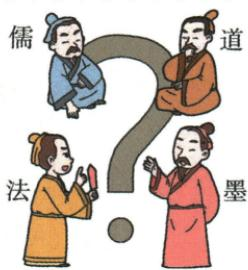

## 讲解

### 是什么

百家争鸣指战国思想学术领域不同学派活跃，聚众讲学、著书立说、提出治国方案并相互辩论的局面。“百家”形容学派众多，不是资料已经统计出恰好一百个；“争鸣”不只是争吵，还包括相互影响、吸收、发展思想。

### 怎么来的

旧制度进一步瓦解，新政治经济秩序逐步建立，诸侯面临富国强兵的现实问题，因此竞相延揽人才；活跃的士阶层可以提出方案并受到重用。铁农具、牛耕推广使生产力提高，为社会变化提供物质条件，但工具本身不会直接产生某条学说，需接到社会问题与人才活动。

“学在官府”的格局被打破，私学发展，使知识传播和讨论不再完全限于官府。更多人能够讲学、研讨并提出不同答案，于是社会需求、人才参与和传播条件相接，形成诸子百家。各派相互抨击，也取长补短，推动概念、方案与著作丰富；这才解释为何争论能够促进繁荣。并非所有观点相同，也非一场漫画中的聚会造就整个思想高峰。

### 什么时候能用

回答出现原因可按经济、政治、阶层、思想传播分别说明；回答影响则从讲学、著书、辩论、相互吸收接到思想繁荣与后世基础。材料没有某一维度时，区分直接提取与结合所学。不能用文化繁荣否认同时存在兼并战争，也不能把战乱说成必然使每个时代都出现百家争鸣。

## 例题

**原资料设问（H7-S06）：**观察此漫画，为什么说百家争鸣促进了思想文化的繁荣？

**原答案：**各家学派的代表人物聚众讲学，研讨学术，著书立说。他们提出各种政治主张和治国方略，希望用自己的学说解决社会问题。各学派之间展开激烈的辩论，相互抨击，同时又相互影响，取长补短，形成了思想文化的繁荣局面。所以说，百家争鸣促进了思想文化的繁荣。

**完整解析补写：**先看漫画标出儒、道、法、墨，确认表现多家讨论，不把漫画人物当成某次真实会议的照片。原答案先列传播与研究方式，再说明各家提出不同方案并相互争辩、吸收，最后接到观点丰富、思想活跃。由多个学派存在到思想繁荣，中间必须说明讨论、传播和相互影响；漫画是现代解释性图画，原课历史知识支撑结论。

## 易错

- 只列四项原因而不解释：每项需说明怎样提供思想活动的需求、人员或条件。
- 把争鸣写成诸子最后统一成一家：原书强调不同学派相争又相互影响。
- 将百家争鸣全放到孔子同时代：老子、孔子为春秋人物，战国诸子推动新的繁荣局面。

### 来源定位

- H7-S06：full.md（历史扫描分册1-50），L4738–L4755，百家争鸣漫画、影响设问及完整原答；22fce0ae-e244-4784-abd1-7e1ac2556947_origin.pdf，实际PDF第44页。
- H7-S07：full.md（历史扫描分册1-50），L4757–L4765，百家争鸣背景及各派人物完整原表；22fce0ae-e244-4784-abd1-7e1ac2556947_origin.pdf，实际PDF第44页。
- H7-S08：full.md（历史扫描分册1-50），L4767–L4771，百家争鸣局面出现原因四维原表；22fce0ae-e244-4784-abd1-7e1ac2556947_origin.pdf，实际PDF第44页。
