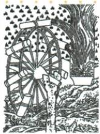

## 讲解

### 是什么

筒车是本书唐代列举的灌溉工具，借水流转动轮体，随轮的筒汲取并提升水，用于田地供水。它直接解决取水灌溉，不是运输人员的车，也不是曲辕犁耕地工具。原题比较对象为人力翻车，讨论水力带来的省力与效率。

### 怎么来的

有高低差或需要把低处水送田时，汲水工作要消耗动力；利用水流驱动轮体，可把自然水流的运动用于持续提升水，减少人手直接驱动需求。原图示水轮与轮缘取水装置，可以辅助理解连续取送水，资料没有完整轮体尺寸、流速和水量，不能补精确力学计算。

动力与用途是两个分类：同样汲水可以采用不同动力，七上原图牛转翻车就是提醒。原答案只说人力翻车与水力筒车的比较，不应将人力写成所有翻车唯一动力。水力工具优势需要水流适宜、位置和田地条件相合，还需要制作维护；无水流时它未必能运作，故效率优势不作任何地点任何条件的绝对结论。技术改进给农业发展条件，但不能凭一个灌溉工具宣称旱涝全部消除。

### 什么时候能用

用于图识别、动力比较、省人力与效率原因。原题答案完整保留，解释限定比较对象与水力条件；原书没有原试验数据，不计算具体效率倍数。

## 例题

**原题（S3-S03）：**筒车与三国时期马钧改进的翻车相比，有哪些优点？

**原答案完整保留：**筒车用水力翻动，翻车用人力翻动，生产力提升。筒车比翻车效率高。

**完整解析补写：**本题比较人力翻车与水力筒车，用水流提供动力可减少人力持续驱动，支持灌溉效率提升。优势需水流、安装和田地位置相适；没有合适水力不一定可运行，不能扩大为任何地点永远更高效。

**原资料内部范围说明：**七上第16课原图明确题注牛转翻车，说明翻车还有其他动力图例；本题原答人力翻车按其比较对象保留，不改成所有翻车都只有人力。动力形式与器物类型分别判断，原书未给同条件效率数据，不自编倍数。

## 易错

- 筒车当翻车所有形式的唯一替代：类型与适用条件不同。
- 水力工具到处自动运行：需水流和安装条件。
- 原答人力翻车扩成全体翻车：前章已有牛转图例。

### 来源定位

- S3-S03：full.md（历史扫描分册51-100），L1777–L1783，筒车原图、原问与翻车比较原答；a8d85606-ccac-4ba9-89c2-44c981a45642_origin.pdf，实际PDF第28页。
- S3-S05：full.md（历史扫描分册51-100），L1797–L1803，农业手工业商业完整表含工具旁注；a8d85606-ccac-4ba9-89c2-44c981a45642_origin.pdf，实际PDF第28页。
