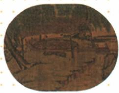

## 讲解

### 是什么

翻车是将低处水提升到田地等较高处、用于灌溉的汲水工具。原书记曹魏马钧改进翻车，使其轻巧、便于操作，长期用于农业生产。原图题注为“牛转翻车”，表示这一图例以牛力带动；不能据一个图例说所有翻车都只有牛力驱动。

### 怎么来的

农业不只需要种子和耕作，还需要合适的水分。水源若低于田地，靠水自然流入往往不够，必须作提升；翻车把连续运动转为连续提升水的过程，使人工搬水以外有更有效的汲水方式。原书只给图例与改进作用，没有完整机械剖面，不能凭黑白图杜撰每个齿轮数量、转速和具体效率。

马钧贡献表述为改进，说明在已有器具基础上使操作更便利，不等同于他第一次发现水能灌田。“轻巧、便于操作”关乎使用条件，能够帮助农田供水，但灌溉收益仍受水源、地形、维护和劳动力影响；一件工具不会使任何地块无旱灾。与耧车播种、水排鼓风冶铁相比，翻车的直接工作对象是水，直接农业作用是汲水灌溉。判断器物应从用途入手，不因名字都有“车”就认成交通工具。

### 什么时候能用

看到马钧、曹魏、汲水或牛转翻车，可关联农业灌溉。原图为书中工具示意，能帮助识别用途，不能当作曹魏当时实物照片或从图上测真实长度。耧车与水排的用途另核。

## 例题

**原资料（H16-S07，未附独立例题）：**曹魏马钧改进用于汲水的翻车，使之轻巧、便于操作，在农业生产中长期使用。

**完整分析补写：**“汲水”定位灌溉需求，“改进”定位贡献类型，“牛转”定位图例动力。自动图像描述曾识别成河岸船只，已对照实际PDF第15页和原图题注纠正；不把误识别内容写成历史知识。这里缺独立匹配题，保留原资料分析。

## 易错

- 翻车当耧车：前者汲水，后者播种。
- 翻车当水排：水排服务鼓风冶铁。
- 改进写首次发明，或牛转图例扩成所有翻车：超出证据。

### 来源定位

- H16-S07：full.md（历史扫描分册51-100），L909–L920，牛转翻车原图及马钧改进翻车；a8d85606-ccac-4ba9-89c2-44c981a45642_origin.pdf，实际PDF第15页。
