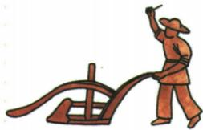

## 讲解

### 判据

农具图片问意义或比较，先定耕地、播种、灌溉，再定动力与适用条件。名字含车或图中有人牛，不能代替实际用途。

### 流程

1. 曲辕犁题注与原问定位耕地，连到精耕细作和劳动效率，不改成播种。
2. 筒车定位汲水灌溉，水流驱动减少持续人力，解释优势来源。
3. 人力翻车是本题比较对象，前章牛转图提示翻车动力还可不同，不能作全称结论。
4. 用水流和安装条件限制筒车优势，原资料无比较数据，不补倍数。
5. 过程从器物工作到农业作用，再到效率，不能用图片直接证明某年全国丰收。

### 方法依据与边界

优点是相对于任务和参照物而言。曲辕犁作用在耕地，结构灵活有助操作，不能用来直接说明自动提水；筒车用水流动力提水，相对原题的人力翻车能省劳力，但水流、安装地点和灌溉需要必须合适。前章有牛转翻车，说明翻车不只有人力，原比较的参照物限定尤其不能省。若地势水流不适合，筒车水力优势未必成立；因此流程先判耕地还是灌溉，再辨动力与结构，最后说明什么条件下解决什么问题，不能只写先进高效就包一切工具。

## 例题

**原题（S3-S02）：**曲辕犁的发明对古代农业的发展有何意义？

**原答案完整保留：**这一耕地工具的发明便于农业精耕细作；促进社会生产力发展；提高农业生产效率。

**完整解析补写：**先定位耕地用途，工具改善土壤耕作，便于精细安排耕作，再联系单位劳动的有效性，说明生产效率与生产力发展。意义不只报工具名；曲辕犁不是播种的耧车，也不是灌溉筒车。原图为示意，不能量真实犁长和亩产增幅；识别表粘入播种工具与实际原页耕种工具旁注不同，不据误识别改用途。

**原题（S3-S03）：**筒车与三国时期马钧改进的翻车相比，有哪些优点？

**原答案完整保留：**筒车用水力翻动，翻车用人力翻动，生产力提升。筒车比翻车效率高。

**完整解析补写：**本题比较人力翻车与水力筒车，用水流提供动力可减少人力持续驱动，支持灌溉效率提升。优势需水流、安装和田地位置相适；没有合适水力不一定可运行，不能扩大为任何地点永远更高效。

**原资料内部范围说明：**七上第16课原图明确题注牛转翻车，说明翻车还有其他动力图例；本题原答人力翻车按其比较对象保留，不改成所有翻车都只有人力。动力形式与器物类型分别判断，原书未给同条件效率数据，不自编倍数。

## 易错

- 图有轮就答运输：作业对象不同。
- 原答效率高变无条件效率高。
- 耕地、播种、供水三个环节互换。

### 来源定位

- S3-S02：full.md（历史扫描分册51-100），L1761–L1775，曲辕犁原图、原题原答；a8d85606-ccac-4ba9-89c2-44c981a45642_origin.pdf，实际PDF第28页。
- S3-S03：full.md（历史扫描分册51-100），L1777–L1783，筒车原图、原问与翻车比较原答；a8d85606-ccac-4ba9-89c2-44c981a45642_origin.pdf，实际PDF第28页。
- S3-S05：full.md（历史扫描分册51-100），L1797–L1803，农业手工业商业完整表含工具旁注；a8d85606-ccac-4ba9-89c2-44c981a45642_origin.pdf，实际PDF第28页。
