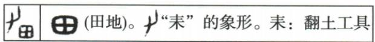

## 讲解

### 判据

题目给甲骨古字形并解释各部件，要求推测含义或产生的生活来源，要以原形与释文共同判断；不只看今天这个字日常表示什么。若问造字方法，还要说明部件表形、指示、组合意义还是提供读音。

### 流程

1. 完整读字形和释文，确认每个部件含义，不以缺失部件的文字摘要或现代楷体替代原古字形。
2. 将部件信息合起来。如物形勾画、上下标记、两人相随，分别对应象形、指事、会意等关系。不能因有两笔就说两部件会意。
3. 问生活来源时，找字形表达的活动与工具；问人物政治制度时，需要相应政治信息，不能由“古代”直接套分封和战争。
4. 对选项按证据逐一核对：符合部件及释文的保留，缺少所问活动信息的排除。
5. 保留“推测”的范围。构形能提示文字形成与生活联系，不能单独证明某一人首次发明该字的日期和全部经过。

## 例题

**原资料造字方法与字形（H8-S08）：**

|方法|原说明|原字形|
|---|---|---|
|象形|最原始的造字方法，用图形、线条勾画物体的外形特征||
|指事|用指示性符号表示事物或概念，如“上”，长横代表水平线，短横表示以上||
|会意|两个或两个以上独体字结合表示新意义，如“从”，两个人形表示跟从||
|形声|声符注音，一个字表示类别，组成新字；能造大量文字，现代汉字很多是形声字||

**材料解析补写：**按原形看表示关系：日、田取物形；上、下借相对位置指示概念；从组合两个人形表示关系；形声要区别表义类别与读音线索。原表把若干古字形配在方法旁，不能只按今天楷书的部件去猜；本课也没有提供每个古字的全部演变谱系，个别字的历时结构须避免由现代读音直接反推。

先依据原造字表理解字形怎样表达意义，再看下列“男”字原题如何用构形与释文判断生活来源。

### 原题5：甲骨“男”字与劳动

**原题（U2-Q05，原资料标注“2024广东中考”，未独立核定试卷身份）：**下图是甲骨文“男”字的构形及释文。据此推测，古代“男”字的出版可能源于（ ）

A.劳动生产　B.分封制度　C.兼并战争　D.祭祀礼仪

**原答案：A。**

**原解题思路：**“耒：翻土工具”体现出“男”字与劳动生产有关。

**原题用词问题：**原页确实写“出版”。按字的构形及释文语境，应理解为字的产生或形成，原题文字保留，解释不据“出版”另造出版业条件。

**入口补写：**先读田地和耒的功能，再联系农业劳动；题目问来源，所问并非甲骨文一般记载哪些事。图的推测范围也不延伸到某人发明此字的年份。

**逐项解析补写：**

- A：对。原构形含田地与“耒：翻土工具”的释文，两项都直接指向农业劳动。
- B：错。图中没有授土授民、受封等级或诸侯义务，田地不等于分封这一制度。
- C：错。翻土工具与田地没有军队、征战或吞并国家的证据。
- D：错。虽然甲骨记载可涉及祭祀，但本题具体构形与释文指向劳动，不能以载体的一般用途替代字形信息。

## 易错

- 只按现代字义答题：题目要求古构形，需要接原释文。
- 将一件翻土工具误联祭礼：先核对工具功能。
- 把合理推测写成有精确发明者和年份的确证：原题没有这些信息。

### 来源定位

- H8-S08：full.md（历史扫描分册1-50），L4890–L4894，甲骨造字四种方法及原字形；22fce0ae-e244-4784-abd1-7e1ac2556947_origin.pdf，实际PDF第46页。
- U2-Q05：full.md（历史扫描分册1-50），L4948–L4960，原编号5男字构形题及原释文；22fce0ae-e244-4784-abd1-7e1ac2556947_origin.pdf，实际PDF第47页。
- U2-A05：full.md（历史扫描分册1-50），L4980–L4982，原题5解题思路与答案A；22fce0ae-e244-4784-abd1-7e1ac2556947_origin.pdf，实际PDF第47页。
