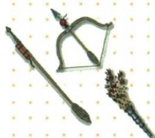

## 讲解

### 判据

图注宋器而问药发明及传欧作用，是跨阶段两任务。先拆对象药与器、发明与应用，再对应世界作用，不因图时代直接答宋首创。

### 流程

1. 图题宋代火器表当前用途，原问上图所用药的发明朝代，依原表唐答，不取宋作首创。
2. 唐末军用、宋元广用、元火铳分用途器具发展，不能合一时点。
3. 传欧影响依原答制造与战法，技术可改变器具与用法；指南定向是另一项，不能答新航路代火药。
4. 两任务都答完整，先唐再影响，原图不清器名只据题注，不用自动矛羽描述造型号。
5. 技术作用需制造组织实践，不能所有战役必胜或社会一夜全变；原资料无药量配方，不算数也不补现代制作步骤。

### 方法依据与边界

题中的图时代与所问对象可能不同。宋代火器是火药的应用实例，题问其所用火药发明朝代，应查药的早期形成，不按器物所属朝代直接回宋。唐发明、唐末军用、宋元广用、传入欧洲后的影响，分别描述形成、用途、范围和传播结果。火药使武器设计和使用能发生变化，才支持原答的火器制造与战法影响；它不承担指南针定向作用。技术作用还需实际制造组织，不把一次发明说成所有战役必胜，更不据图补原文没有的配方与型号。

## 例题

**原题（B14-S05）：**说出上图所使用的火药发明的朝代以及火药传入欧洲后产生的影响。

**原答案完整保留：**唐朝。我国发明的火药和火器传入欧洲后，对欧洲的火器制造和作战方式产生影响。

**原火药表（B14-S01，非独立题）：**唐已发明，唐末始军用，宋元更多用于战争、元火铳；13世纪传阿拉伯地区，14世纪初经阿拉伯传欧。

**完整解析补写：**图注宋代火器是此时应用，原问药发明朝代要回唐，不直接看图宋就答宋首创。影响分制造和战法：火药作为火器使用条件，技术传播让器具与作战手段发生改变，不能只答远洋航行，那主要对应指南针。自动图像描述的矛弓羽物不是原完整标签，只依原题注与技术背景，不自猜每个火器型号或配方。

## 易错

- 图宋便说药首创宋。
- 火药世界作用写导航。
- 只朝代不答第二作用问。

### 来源定位

- B14-S01：full.md（历史扫描分册101-150），L1–L11，指南针与火药时间技术用途传播完整原表、四发明；6484926a-d709-4079-96ba-4a8c4b0a1b00_origin.pdf，实际PDF第1页。
- B14-S05：full.md（历史扫描分册101-150），L35–L49，宋火器原图、发明朝代及传欧影响原问原答；6484926a-d709-4079-96ba-4a8c4b0a1b00_origin.pdf，实际PDF第1页。
- B14-S12：full.md（历史扫描分册101-150），L106–L108，四大发明历史意义四行完整原表；6484926a-d709-4079-96ba-4a8c4b0a1b00_origin.pdf，实际PDF第3页。
