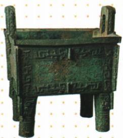

## 讲解

### 判据

给器物、铭文、遗址或天文记录，问文化成就或价值，就要把具体发现接到技术、组织、生活或记录信息。器物很大、文字很多不是完整答案，必须解释它们各自支持哪个判断。

### 流程

1. 先认载体与时代：青铜器、甲骨、遗址、诗歌提供的信息不同。不得将骨上文字误叫金文，或将后世释义当原铭文。
2. 抽取可见或可读事实。鼎的体量和复杂工艺联系制作技术与组织；甲骨的可识读内容联系活动记录；二里头宫殿、作坊和墓葬组合联系分工、权力与等级。
3. 解释中间机制。复杂制造需技术、原料与协作；文字记录让过去的活动留下具体线索。不能从漂亮、古老等评价直接跳到所有制度结论。
4. 用多种证据互补，并限定范围。单件鼎不代表全民生活，单片甲骨不代表全朝史，文化联系不自动代表直接管辖。
5. 如果问作用，要先说实际功能再到社会影响。例如都江堰分洪、控流、灌溉改善生产条件；但工程史价值与本题青铜工艺结论是不同对象，不能挪用无关材料。

## 例题

**原资料设问（H8-S05）：**请对上述青铜器进行讲解。

**原答案：**司母戊鼎是世界上出土的最重的青铜器之一，重达832.84千克，也有学者认为应称为“后母戊鼎”。司母戊鼎的铸造，充分说明商朝时期的青铜铸造业不仅规模宏大，而且组织严密，分工细致，足以代表高度发达的商朝青铜文化。

**完整解析与名称核查：**先据题注确认器物，再以巨大器形、铸造复杂性说明资源投入、组织和分工；重量本身不能推出当时每件青铜器都同样大。国家博物馆现称“后母戊”青铜方鼎，注明曾称“司母戊鼎”，公布重量832.84千克，并将最重范围限定为目前已知中国古代青铜器。原题及原答名称保留，讲解用双名对应检索，不将来源的范围扩成所有时代、所有类别的青铜作品。[核查：中国国家博物馆“后母戊”青铜方鼎](https://www.chnmuseum.cn/zp/zpml/kgfjp/202008/t20200824_247255.shtml)

## 易错

- 只说古代人民聪明勤劳：应先用材料说明技术和协作依据。
- 把每一件原物都当成全社会全时段：结论范围不能超过材料。
- 因两个名称不同建两个器物条目：先核对是否同一文物的旧名和现名。

### 来源定位

- H8-S02：full.md（历史扫描分册1-50），L4809–L4823，甲骨文与青铜器、金文；22fce0ae-e244-4784-abd1-7e1ac2556947_origin.pdf，实际PDF第45页。
- H8-S05：full.md（历史扫描分册1-50），L4845–L4857，司母戊鼎原图、讲解设问与完整原答；22fce0ae-e244-4784-abd1-7e1ac2556947_origin.pdf，实际PDF第45页。
- H8-S06：full.md（历史扫描分册1-50），L4876–L4880，金文与三星堆原表；22fce0ae-e244-4784-abd1-7e1ac2556947_origin.pdf，实际PDF第46页。
- H4-S02：full.md（历史扫描分册1-50），L4386–L4404，夏朝、世袭制、二里头与夏亡；22fce0ae-e244-4784-abd1-7e1ac2556947_origin.pdf，实际PDF第38页。
- H6-S07：full.md（历史扫描分册1-50），L4640–L4642，都江堰修建、功能、作用；22fce0ae-e244-4784-abd1-7e1ac2556947_origin.pdf，实际PDF第42页。
