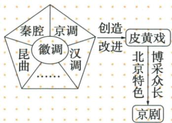

## 讲解

### 判据

地方声腔来源、艺术改良、外来戏班入京、新剧种渐成不是同一动作。原昆山腔与昆曲配，1790徽班入京与道光皮黄配京剧；作品作者再校相应时代，别由都属清文化合成一事。

### 流程

1. 昆曲按昆山腔起源、早期改良、万历发展和清前期鼎盛分层，不读万历才初改。
2. 京剧先用1790乾隆80寿辰定位徽班进京这一背景，非当日新剧种已成。
3. 原图多声腔连徽调，经过创造改进到皮黄，恢复多来源汇合，不采用抽取错误串行。
4. 道光逐渐成、后称京戏京剧分别保留；北京特色与博采众长是特点。
5. 昆曲牡丹亭等与京剧形成关系不同，吸收昆曲不等昆曲消失改名。以动作定阶段、以图箭线定关系，才能防只背1790便包全部艺术过程。

## 例题

**原昆曲表（M21-S09，非独立题）：**起源苏州昆山腔；原发展栏“明朝万历末年，经过改良”，昆曲发展表演成熟成全国剧种；清前期鼎盛。明汤显祖《牡丹亭》，清洪昇《长生殿》、孔尚任《桃花扇》。

**规范补充与界限：**中国非物质文化遗产网官方项目介绍记嘉靖年间魏良辅等革新昆山腔、吸收其他腔长处，昆曲基本成型。因此原发展栏保留，但不能推万历末才第一次改良或才起源。起源、改良成型、广泛发展、鼎盛是不同阶段。昆曲是以歌唱等舞台表演故事的戏曲形式，剧作与剧种有关又非一回事，同一剧种可以有不同作者不同时代作品，不把汤显祖当京剧形成者。

**原京剧表（M21-S10，非独立题）：**1790乾隆80寿辰，徽商组织徽班进京；徽调不断吸收昆曲、秦腔、京调、汉调等长处，创造改进，道光年间逐渐形成皮黄戏，后称京戏、京剧。

**原图关系核验（M21-S14）：**秦腔、京调、昆曲、汉调等与徽调的融合，经过创造改进形成皮黄戏；北京特色和博采众长指形成后的特点。原自动Mermaid将秦腔指京调、昆曲指徽调等拆成几条孤立串行，不能代替原图的多来源关系。

**完整分析补写：**入京使不同戏班声腔接触有条件，吸收融合并创造改进才形成新剧种；有时间过程，1790入京不是京剧当日完成。京是形成环境与名称，不证明只靠一种北京地方声腔；有昆曲输入也不意味昆曲消失或全部改名京剧。原后称二字区分形成与名称使用，未给每一步唯一精确年，不自造年表。

## 易错

1790不是所有昆曲京剧起源年；秦腔不先变京调再变徽调；同一剧种作品不同作者，汤显祖不配京剧形成者。

### 来源定位

- M21-S09：full.md（历史扫描分册101-150），L1149–L1153，昆曲起源发展鼎盛与明清三个剧作原表；6484926a-d709-4079-96ba-4a8c4b0a1b00_origin.pdf，实际PDF第19页。
- M21-S10：full.md（历史扫描分册101-150），L1155–L1157，1790徽班入京和道光皮黄形成原表；6484926a-d709-4079-96ba-4a8c4b0a1b00_origin.pdf，实际PDF第19页。
- M21-S14：full.md（历史扫描分册101-150），L1177–L1195，京剧多声腔创造改进与北京特色博采众长原图；6484926a-d709-4079-96ba-4a8c4b0a1b00_origin.pdf，实际PDF第19页。
