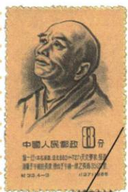

## 讲解

### 判据

题注人物后问领域成就，或表给书籍问作者时期，按领域、人物、成果、形成形式四项配对；共同都是古代文化不能代替准确身份。

### 流程

1. 僧一行题注连天文观测，答天文学和大衍历，祖冲之大明历另配。
2. 孙思邈连千金方与药王，原药方药物单位分开。
3. 唐本草连高宗时国家编颁药典，作者组织形式不同于个人千金方。
4. 颜柳书法、阎吴绘画、李白杜甫白居易诗歌，先门类再特点。
5. 原独立题仅僧一行；其他原表做分类解释并标明，不伪造多选题。

### 方法依据与边界

配对先定成果内容，再看其形成形式，能防止同领域著作互换。例如历法来自天文观测，不因作者为僧人便改作宗教经典；千金方整理个人医药经验，唐本草国家组织编颁，二者都医书却不等同。数量题尤其要保留单位：多种药物可组成多个药方，两个数字不同并非互相否定。艺术人物先分字与画，再核风格描述，不能用一个雄劲词猜作者。原问只要一行领域与成果，其他表项是帮助建立分类，既不要求凭空添作品，也不把分类示范包装为原来没有的选择题。

## 例题

**原题（S7-S02）：**僧一行是哪一领域的专家？有何成就？

**原答案：**天文学。《大衍历》。

**完整解析补写：**题注先识别僧一行，联系本课观测、历法研究，领域答天文学，成果答《大衍历》。原问只列这一成果，原表还说组织子午线测量，可作成就补充，不能用数学贡献把领域改成只有数学。僧的身份不表示其所有工作都只属宗教，邮票也不是大衍历书页或唐代原始照片。

**原资料医药表（S7-S03，非独立题）：**《千金方》由孙思邈所著，总结此前医学理论与实践，收集5300多个药方、记载800多种药物，重药物采集配制使用，后世尊药王。《唐本草》为唐高宗时编修，是世界上第一部由国家编定颁布的药典。

**完整分析补写：**药方是配伍使用的方案，药物是其中涉及的对象，数量不能互换，也不把多个省成恰好5300。千金方强调个人整理经验与著述，唐本草强调国家组织编修颁行，前者不是全国国家药典的同义词。药王配孙思邈，汉代张仲景医圣、华佗麻沸散各自核，不因皆医学就互换人物朝代。原表无独立题，不自编诊疗情境。

**原资料（S7-S06，非独立题）：**隋唐书法名家辈出，颜真卿端正劲美、雄浑敦厚，柳公权方折峻丽、笔力劲健；绘画有人物、山水、花鸟和宗教等题材，阎立本人形各异、神形兼备，吴道子落笔雄劲、风格奔放。原页旁注吴道子代表作《送子天王图》。

**完整分析补写：**颜柳的描述关注字的点画和结构，阎吴关注图像人物、落笔和表现，先定门类再配人物风格。雄浑、雄劲词相近不能证明同一个作者；阎立本人画神形兼备是绘画表现评价，不表示画里每个细节必然是现场记录。本课没有提供四位作品完整图像或独立题，不能制造凭图识字题。

## 易错

- 身份僧人便所有成果都宗教。
- 书名近似互换人物。
- 国编与个人著述不分，首创对象被删。

### 来源定位

- S7-S02：full.md（历史扫描分册51-100），L2191–L2209，僧一行邮票及领域成就原问原答；a8d85606-ccac-4ba9-89c2-44c981a45642_origin.pdf，实际PDF第34页。
- S7-S03：full.md（历史扫描分册51-100），L2211–L2213，雕版天文医药完整表；a8d85606-ccac-4ba9-89c2-44c981a45642_origin.pdf，实际PDF第34页。
- S7-S06：full.md（历史扫描分册51-100），L2231–L2233，颜柳书法、阎吴绘画及吴代表作原旁注；a8d85606-ccac-4ba9-89c2-44c981a45642_origin.pdf，实际PDF第35页。
