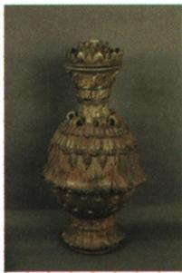

## 讲解

### 判据

看到原题注南朝青瓷莲花尊且问了解什么，应定位制瓷手工业发展。器物外形可辅助识别，历史年代、材料类别和作用首先据题注与本课内容，不从赞誉推政治制度。

### 流程

1. 题注定位南朝和青瓷，不把“青”字当青铜材质。
2. 作为制瓷成品，它与本课手工业发展相对应，答江南制瓷业发展。
3. “青瓷之王”保留为原书称誉，不转成皇帝专用、制度等级或客观排名。
4. 联系青瓷工艺已有此前积累，南朝成品体现继续发展，不说瓷器到南朝才首次出现。
5. 限制推断：一件成品不提供全部行业产量和各地质量，照片颜色也不提供烧温化学配方。

## 例题

**原资料（H18-S05）：**南朝青瓷莲花尊。通过上图，我们能知道什么？

**原答案完整保留：**南朝青瓷莲花尊被称为“青瓷之王”，它反映了东晋南朝时期江南地区制瓷业的发展。

**完整解析补写：**题注定位年代和器类，器物作为制瓷成品，配合本课手工业材料说明制瓷发展。“青瓷之王”是本书对这件成就的赞誉，不能据此断言它是皇帝专用、所有瓷器质量排名第一或有某种制度地位。仅凭照片不能判断烧制温度、原料成分或产量，也不能把它归为青铜器。自动图片描述中的小提琴、王冠没有原图依据，已弃用。

## 易错

- 形制复杂就补无来源烧温、年产量：证据不足。
- 青瓷之王当专属皇帝：赞誉与制度不同。
- 南朝例证推青瓷首创南朝：东汉技术节点已有记录。

### 来源定位

- H18-S05：full.md（历史扫描分册51-100），L1085–L1099，青瓷莲花尊原图、原问原答；a8d85606-ccac-4ba9-89c2-44c981a45642_origin.pdf，实际PDF第18页。
- H18-S06：full.md（历史扫描分册51-100），L1101–L1103，江南开发背景条件及农业手工业商业完整表；a8d85606-ccac-4ba9-89c2-44c981a45642_origin.pdf，实际PDF第18页。
