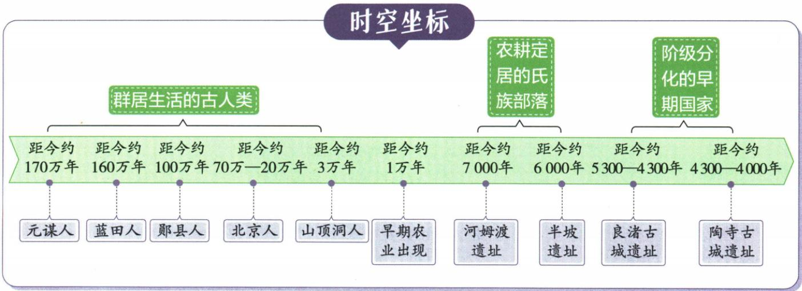

# 原始社会与中华文明的起源

先学会从遗存作出有限、有依据的判断，再理解生产发展与社会变化的联系。年代和名称帮助定位，但不能替代证据和因果。

## 阅读顺序

1. **远古时期的人类活动。**从[我国境内的古人类遗址](知识-我国境内的古人类遗址.md)开始，了解化石与工具各能研究什么，再读北京人、山顶洞人与[史料的类型与证据效力](知识-史料的类型与证据效力.md)。不要从体貌直接推出农耕或工具技术。
2. **原始农业与史前社会。**读[原始农业与定居生活](知识-原始农业与定居生活.md)，把栽培、照料与定居接起来；再结合河姆渡、仰韶半坡、大汶口与龙山的材料，分别判断工艺、资源分化和环境适应。
3. **中华文明的起源。**读[早期国家与文明社会](知识-早期国家与文明社会.md)，用良渚、陶寺的具体证据理解社会等级与组织能力，再看多元一体和远古传说。传说的文化价值与具体情节是否得到证实，是两个问题。

## 原书时空线索

图中从古人类、早期农业到良渚、陶寺呈现不同时间线索。注意它是把代表遗址放在时间坐标上，不能据此把五种古人类连成已证实的直接祖先链，也不能认定不同地区所有人同时改变生产方式。约数和跨越区间都须保留。

时间坐标说明先后与大致时间范围；要理解农业、社会分化和早期国家之间的原因，还需回到各条目的具体材料与解释。

## 原题中的判断

- 北京人头像比较：先明确题目问体貌，再判断图像能支持的特征。
- 河姆渡与半坡房屋：分别说明环境需要与结构作用，再概括适应自然。
- 多地区龙元素器物：同时解释地域特色与共有因素，判断文明联系。
- 考古发现与结论：逐项核对是否回答同一种问题，不跨越证据范围。
- 文明起源研究依据：结合史前研究对象比较四项来源，保留核验边界。

题干、原答案、原解题思路及逐项解析均保存在相应条目中。没有独立原例题的概念在条目内明确注明缺口；不要把材料解释误当另有一道原题。

来源：H0-S02，full.md（历史扫描分册1–50），L3707–L3748；22fce0ae-e244-4784-abd1-7e1ac2556947_origin.pdf，实际PDF第30页。
