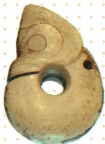
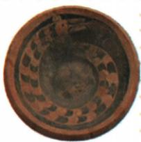

## 讲解

### 是什么

多元一体是中华文明起源和初步发展的重要特征。“多元”指不同地区形成各具特色的早期文化、文明；“一体”指它们通过联系、交流、吸收和融合，共同构成早期中华文明的主体。它不是“所有地区毫无联系”，也不是“所有器物完全一样”。

本课以黄河、长江、西辽河流域的不同早期文明及它们的联系说明这一特征。原资料还概括中原地区广泛吸收各地文明要素而崛起，开始形成以中原地区为引领的文明新格局。这里的“一体”谈文明联系与整合，不能直接替换为全国已被同一个政权统一。

### 怎么来的

先看差异：遗址位于不同地区，器物有不同材质、形态与制作方式，说明发展具有各自特色。再看联系：不同地区出现相近文化符号、器物要素，或发现来自其他地区的材料，说明不能把各地视为孤立单元。把“特色”和“联系”放在一起，才解释了多元一体，而不是只背四个字。

不同证据支持的结论强度不同。相似龙元素能提示共同文化要素，但单凭两幅器物图还不能绘出全部交流路线、确定谁影响谁。讨论传承性，需要结合年代与文化联系；讨论创新性，需要说明形式、工艺等变化。图片提供线索，完整认识还要结合本课背景。

### 什么时候能用

材料将多地器物、遗址并列，突出既有差异又有共同因素时，可用于解释多元一体。若只给一件器物，没有空间或文化比较，不宜直接推出全部文明起源格局。相似纹样也不证明只有一个国家或单一族群。

## 例题

**原资料设问（H3-S01）：**通过这两件器物，概括远古时代中华文化呈现出的特点。

**原答案：**多元一体性；传承性；创新性。

**解析补写：**首先读图注，确定是不同遗址、不同形态与材质的器物；其次注意共有的龙元素，结合本课各地文化交流、融合的说明，可概括多元一体。原答案还给传承、创新：共同文化元素的延续可与传承联系，不同材质和表达形式体现变化；但仅凭图片本身不能完整证明传播先后及直接影响链，因此作这两项概括需结合所学，而不能声称已从图中独立考证全部关系。牛河梁的辽宁定位与红山文化归属另经中国国家博物馆藏品说明核查，未改题中图注。

## 易错

- 把多元理解为没有联系：本课同时强调各地交流、融合。
- 把一体理解为器物全相同或已经政治统一：文化关联与政治组织要分别判断。
- 从共同纹样直接指定传播路线：相似是线索，具体路线和先后还需年代、出土背景等证据。

### 来源定位

- H3-S01：full.md（历史扫描分册1–50），L4001–L4025，玉猪龙和陶寺龙纹陶盘的文化特征问答；22fce0ae-e244-4784-abd1-7e1ac2556947_origin.pdf，实际PDF第34页。
- H3-S04：full.md（历史扫描分册1–50），L4046–L4048，良渚陶寺遗址、考古证据及多元一体意义；22fce0ae-e244-4784-abd1-7e1ac2556947_origin.pdf，实际PDF第34页。
