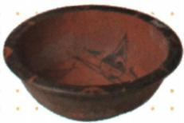

## 讲解

### 是什么

仰韶文化主要分布于黄河中游，距今约7000—5000年，彩陶是其重要特征。考古文化名称用来概括一组具有相近特征的遗存，不等于只指一个村落，也不能直接当作现代行政区或已经证明的单一族群。

半坡是仰韶文化的代表遗址之一，位于陕西西安东部半坡村，距今约6000年。居民主要住半地穴式房屋，屋内有灶坑；种植粟、黍，制作磨制石器，饲养猪、狗，并进行渔猎、采集。出土骨针、骨锥和纺轮，原资料据此说明纺织、制衣；还制作陶埙、使用装饰品。

### 怎么来的

仰韶与半坡是“文化范围”和“具体代表遗址”的关系。先确定文化共有特征，再看具体遗址，能避免把半坡全部特点说成仰韶所有地点都完全一样。

原书用墓葬规模与随葬品说明社会变化：仰韶早期没有明显贫富分化，晚期出现较大差别。不同阶段的证据反映变化，不能取早期一句话概括整个文化历程。彩陶可以研究工艺和文化特色，墓葬差异则提供资源与地位不均等的线索；两类材料回答的问题不同。

半地穴式房屋的部分居住空间位于地面以下。原书单元题将这种形式与黄河流域较干旱寒冷、风沙较大的环境相联系：较低的居住空间有利于保温和挡风雨。这里讲的是结构对居住需要的作用，不能说“北方所有地区只能盖这种房屋”。

### 什么时候能用

材料出现黄河中游、彩陶、半坡、人面鱼纹陶盆等线索时，可联系仰韶文化；若进一步问半坡生产生活，才使用粟黍、半地穴式房屋等具体遗址信息。仰韶文化的时间范围与半坡约6000年的定位不同，不能把二者写成同一个起止时间。

## 例题

**原资料设问（H2-S08）：**陕西半坡出土的人面鱼纹陶盆，这一文物可以用来研究哪一居民的生产生活状况？

**原答案：**仰韶文化的半坡居民。

**解析补写：**看到出土地“半坡”，先确定具体遗址；再依据半坡是仰韶文化代表遗址，形成“仰韶文化的半坡居民”的完整定位。陶盆属于居民的器物遗存，能研究陶器制作与相关生活。仅凭鱼纹不能独自证明已经驯养鱼类，也不能把出土地点不同的陶器都判成半坡器物。

## 易错

- 把半坡与仰韶当成互不相干的两个文化：半坡是仰韶文化的具体遗址代表。
- 把彩陶当所有新石器文化唯一特征：本条所说的是仰韶的重要特征，不能排除其他文化有陶器。
- 忽略“晚期”而写整个仰韶始终平等：原资料明确出现阶段变化，答案要保留时间范围。

### 来源定位

- H2-S05：full.md（历史扫描分册1–50），L3951–L3959，仰韶、大汶口对比与半坡遗址；22fce0ae-e244-4784-abd1-7e1ac2556947_origin.pdf，实际PDF第33页。
- H2-S08：full.md（历史扫描分册1–50），L3983–L3987，人面鱼纹陶盆所属居民问答；22fce0ae-e244-4784-abd1-7e1ac2556947_origin.pdf，实际PDF第33页。
