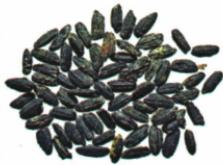

## 讲解

### 是什么

原始农业是先民开始人工栽培作物的生产活动，与直接采集自然生长的食物不同。原书写：距今约2万年，先民开始管理一些野生植物；距今约1万年，南北方出现人工栽培的水稻、粟、黍，早期农业出现。管理野生植物与已形成作物栽培是不同阶段，不能把前一个时间直接写成农业已经出现。

定居生活指较稳定地居住于一定地点。农业发展促进定居，但“出现农业”和“所有人同时停止迁移、采集狩猎”不是同一件事。种植与采集、狩猎、饲养家畜可以并存。

### 怎么来的

采集主要从自然环境中获取现成食物；栽培则需要选择植物、播种或管理，并等待生长收获。粮食生产由此增加了人为控制的环节，能提高在适宜环境中获得食物的能力，但仍受自然条件影响，不能理解为完全摆脱自然。

为什么促进定居？作物长在固定土地上，种植后要持续照料，收获后还需要储存；频繁远距离迁移不利于这些活动。因此栽培发展为较稳定的聚落提供条件。粮食与人口增长又可为更多分工、复杂社会组织提供基础，这是农业与文明形成之间的联系；农业出现本身还不能直接证明已经有国家。

认识早期农业应寻找与栽培有关的证据。原书图注已把相关遗存指认为炭化稻粒、粟粒、黍粒，并将其用于农业研究。实际考古还需鉴定植物种类、栽培特征和年代；不能拿任意植物遗存或一张没有图注的谷粒照片就直接判定栽培。

原书相关链接还介绍河南舞阳贾湖遗址：距今约9000—7500年，出土炭化稻粒、家猪骨骼，并有石器、陶器和骨器。原文据这些发现说明农业、畜牧业已初步发展。它补充了早期生产方式的证据，但不能用贾湖的定位替换河姆渡、半坡等遗址，也不能把原书的“初步发展”夸大成成熟国家。

### 什么时候能用

题目问农业出现、人工栽培、定居原因，或给早期农作物遗存时，可用“栽培活动—持续照料与收获储存—较稳定居住”的联系。原书称我国是世界农业起源地之一，并以“目前已知”限定早期水稻、粟、黍的地位；不能把“之一”删成世界唯一农业起源地。

## 例题

**原资料设问（H2-S01）：**上面两张图片可共同用于研究什么课题？

北京门头沟东胡林遗址出土的炭化粟粒和黍粒（识别文件分为七个裁片，按原页从左至右排列）：

      

**原答案：**我国史前时期原始农业的兴起和发展。

**解析补写：**先读图注，分别确定是浙江义乌桥头遗址的稻粒和北京东胡林遗址的粟、黍粒。共同点是史前遗址中的粮食作物遗存，而不是都来自同一地区或种同一种作物。因此共同研究课题应概括到原始农业的兴起与发展。原图注和原书农业说明提供了栽培背景；仅看粒子颜色和大小不能自行得出种类、精确年代或社会等级。

## 易错

- 把管理野生植物与成熟栽培画等号：两者在人为控制食物生产的程度上不同，原书也列成两个阶段。
- 把农业、定居、文明写成同一年发生：农业促进后续变化，不能将因果联系压成同时发生。
- 见炭化谷粒就推“已有阶级”：谷粒能研究食物与农业，阶级需要资源和权力不平等的证据。

### 来源定位

- H2-S01：full.md（历史扫描分册1–50），L3889–L3913，炭化稻粒、粟黍图片与共同研究课题问答；22fce0ae-e244-4784-abd1-7e1ac2556947_origin.pdf，实际PDF第32页。
- H2-S02：full.md（历史扫描分册1–50），L3915–L3925，骨耜用途与河姆渡作物问答、贾湖相关链接；22fce0ae-e244-4784-abd1-7e1ac2556947_origin.pdf，实际PDF第32页。
- H2-S03：full.md（历史扫描分册1–50），L3927–L3942，原始农业起源、地位与定居意义；22fce0ae-e244-4784-abd1-7e1ac2556947_origin.pdf，实际PDF第32页。
