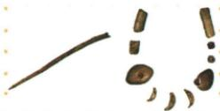

## 讲解

### 是什么

山顶洞人生活在距今约3万年，遗址位于周口店龙骨山顶部的洞穴，模样与现代人相同。他们继续使用打制石器，开始制作骨器，掌握磨光、钻孔技术；原书谨慎写为“可能已经知道人工取火”。他们以采集、狩猎为生，也捕鱼、缝制衣服，有爱美意识，埋葬死者，与其他原始人群有交往。

原书概括其社会组织为集体生活：共同使用工具、劳动和分配食物，没有贫富贵贱差别。这里描述原始社会的生产与分配条件，不能套成后来的国家制度。

### 怎么来的

认识技术要从加工痕迹推到完成加工所需的能力。骨针细长、有针孔，可说明制作者已经能够加工骨料、打磨和钻孔；它与缝制衣服的需要相联系。装饰品也有加工与穿系的痕迹，结合其装饰用途，能支持有爱美意识的判断。每一步都应围绕材料所显示的形状、加工方式和用途，不是因为“年代晚”就认定一切技术都更先进。

山顶洞人虽然掌握磨光和钻孔，却仍属于旧石器时代。原因是“会打磨某些骨器、饰品”和“以磨制石器为主要石器”的分类标准不同，不能看到一个“磨”字就改变时代归属。现代人的外貌也不等于现代人的生活方式；原材料仍写采集、狩猎，不应改成农业定居。

“可能”保留了推断强度。面对人工取火的问题，应沿用这一限定，不能把尚有推测性质的认识写成已确定史实。

### 什么时候能用

图中出现山顶洞人的穿孔骨针、装饰品时，可联系磨光钻孔、缝衣和爱美意识；若仅展示骨针而无装饰品，不宜单凭针孔推出所有装饰活动。与北京人比较时，要分别核对年代、体貌、工具与用火，不把一个项目的差异自动推广到所有项目。

## 例题

**原资料设问（H1-S07）：**山顶洞人使用的骨针和装饰品，此图反映了当时怎样的历史现象？

**原答案：**山顶洞人有爱美意识；掌握了磨光和钻孔技术。

**解析补写：**图注先确定器物属于山顶洞人，避免把不同遗址的骨器混为一谈。再看骨针和饰品的加工形态：针、孔和被加工的外形需要相应技术，故可答磨光、钻孔；饰品的用途指向装饰，故可答爱美意识。图中没有房屋或农作物，不支持已建干栏式房屋或开始种植水稻的答案。

## 易错

- 把“磨光骨针”改写为“主要使用磨制石器”：骨、石材料不同，局部加工技术与时代主要工具不同。
- 把“模样与现代人相同”改写为“生产生活与现代人相同”：体貌判断不能替代生产方式判断。
- 删去人工取火前的“可能”：会让原资料的推断被误读为确定事实。

### 来源定位

- H1-S05：full.md（历史扫描分册1–50），L3824–L3826，山顶洞人体貌、生产生活与社会组织；22fce0ae-e244-4784-abd1-7e1ac2556947_origin.pdf，实际PDF第31页。
- H1-S07：full.md（历史扫描分册1–50），L3841–L3843，山顶洞人骨针装饰品设问及原答；22fce0ae-e244-4784-abd1-7e1ac2556947_origin.pdf，实际PDF第31页。
- H1-S08：full.md（历史扫描分册1–50），L3845–L3849，北京人与山顶洞人对比表；22fce0ae-e244-4784-abd1-7e1ac2556947_origin.pdf，实际PDF第31页。
