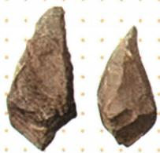

## 讲解

### 是什么

古人类遗址是古人类活动留下遗存的地点。遗址中的人类化石、石器等能帮助研究者认识古人类的体质和生活。化石是古代生物遗体或遗迹在地层中保存下来的证据；它与后人画出的复原像不同，前者是过去留下的材料，后者是依据材料作出的重建。

原资料列出元谋人、蓝田人、郧县人、北京人、山顶洞人。前三者的定位分别是：云南元谋，距今约170万年，发现两颗门齿化石和粗糙石器；陕西蓝田，距今约160万年，原表列一个完整头骨化石；湖北郧阳，距今约100万年，原表列3个头骨化石。研究表明他们已能制作、使用工具。这里的“距今”是距现在的年代估计，“约”表示近似，不能删掉。

### 怎么来的

史前时期缺少可直接叙述生活的文字记录，认识古人类要从遗存出发。牙齿、头骨的形态可以提供身体特征的线索；有人工加工痕迹的石器可支持制作、使用工具的判断。研究者还要核对出土地点、地层和年代，确认不同材料是否属于同一背景，而不是把同一地区的所有发现都归给一种古人类。

证据的作用有范围：两颗门齿可以研究古人类及其体质，却不能单独恢复全部容貌；石器可以研究工具制作，却不能单独证明已会人工取火。不同遗址年代可用来建立先后顺序，但时间先后不等于已经证明它们是一条直接的祖先、后代链。

原资料还指出，化石是研究古人类历史和古环境变迁的重要证据。讨论古环境，通常还要结合遗址中的其他生物遗存和地层材料，不能只凭一颗人牙包办全部判断。

### 什么时候能用

题目问遗址定位、古人类研究依据或化石价值时，可按“发现地点与年代—发现材料—材料能回答的问题”组织答案。元谋人的地位沿用原书“我国境内目前已知最早的古人类之一”，不能改为“中国最早”“世界最早”或“唯一最早”。“目前已知”本身说明结论受已发现材料限制。

## 例题

**原资料设问（H1-S02）：**元谋人上门齿化石的价值是什么？

**原答案：**元谋人上门齿化石可以作为研究“我国境内的古人类”的珍贵史料，其属于第一手史料中的实物史料，研究价值高。

**解析补写：**先看图注，材料是出土的古人类牙齿化石，所指对象不是后人编写的故事。再看问题问“价值”，应说明它提供了什么研究依据，而不只是复述名称。它属于过去留下的实物材料，可用于研究我国境内古人类，因此具有第一手实物史料的价值。牙齿的研究价值不等于仅凭这两颗牙就能判定古人类全部生产生活情况。

## 易错

- 把“郧县人”写成“勋县人”：前者的“郧”是地名用字；原资料注明读yún，发现地点在湖北郧阳。
- 把“距今170万年”理解为公元前170万年：前者是相对年代的约数，不能机械改写成精确公元纪年。
- 按年代把五种古人类连成已证实的直系演化链：这些遗址能提供阶段和分布的线索，直接亲缘关系需要额外研究证据。

### 来源定位

- H1-S02：full.md（历史扫描分册1–50），L3773–L3787，元谋人上门齿化石与价值设问及原答；22fce0ae-e244-4784-abd1-7e1ac2556947_origin.pdf，实际PDF第30页。
- H1-S03：full.md（历史扫描分册1–50），L3805–L3811，我国境内古人类概况及三处遗址比较表；22fce0ae-e244-4784-abd1-7e1ac2556947_origin.pdf，实际PDF第30页。
