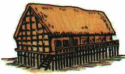
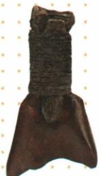

## 讲解

### 是什么

河姆渡遗址位于浙江余姚，长江下游地区，距今约7000年。原资料把它作为史前稻作农业繁荣的代表：发现大量水稻遗存，广泛使用骨耜；以猪、狗为主要家畜，也狩猎野猪、鹿等。先民住干栏式建筑，还修建木结构水井，制作陶器、玉器、骨哨，懂得使用天然漆和雕刻技术。

骨耜是一种铲状农具，能帮助进行翻土等农业作业。它是骨器，不因用于新石器时代农业就变为石器。干栏式建筑用木桩等支起居住空间，图中架高的结构是识别重点；图注明确为复原想象图。

### 怎么来的

河姆渡稻作农业的认识由一组证据支撑：大量稻谷遗存说明种植、利用水稻的规模，农业工具显示生产技术，遗址中的建筑、水井等反映聚落生活。将这些材料联系起来，才有比单件器物更完整的生产生活认识。

为什么骨耜能改善生产？加工出的刃部配合木柄，可更有控制地挖掘、整理土地，满足栽培劳动的需要。原图保留藤条和残木柄，也能帮助理解农具是怎样装接使用的。这是对“先进农业工具”的具体解释，不把一件骨耜独自说成全部稻作农业的证据。

为什么采用架高的房屋？原书单元题说明长江流域气候潮湿温热，架高居住空间有利于通风、防潮，并可减少蛇虫等侵扰。自然环境提出居住需要，人们通过建筑结构作出适应，因果联系落在“环境条件—居住困难—结构作用”上。

### 什么时候能用

看到浙江余姚、长江下游、水稻、骨耜、干栏式建筑等组合线索，可定位河姆渡。只出现“猪、狗”或“陶器”不足以唯一定位，因为其他史前文化也可能有这些特征。答粮食作物时写水稻；答工具材质时写骨器；答房屋依据时看架高结构，不能把三类信息互相代替。

## 例题

**原资料设问（H2-S02）：**上图河姆渡遗址出土的骨耜的用途是什么？河姆渡先民种植的粮食作物是什么？

**原答案：**从事农业生产。水稻。

**解析补写：**题目有两个问题。第一问看器物名称和形制，骨耜作为铲状农具服务农业生产；第二问是遗址与作物的对应，依据河姆渡的大量水稻遗存及课文说明答水稻。不能从铲状外形直接识别粮食品种，因此第二问还要结合遗址背景。骨耜用于农业，也不等于这一件工具能证明全部栽培规模。

## 易错

- 把河姆渡定位到黄河中游：原资料定位为浙江余姚、长江下游，不能与半坡的地域互换。
- 把骨耜写为磨制石器：材料是骨，原书表格里的材质归类错误已另作说明。
- 把房屋复原图当原始建筑保存完整的照片：图示结构是重建结果，使用时须保留图注。

### 来源定位

- H2-S02：full.md（历史扫描分册1–50），L3915–L3925，骨耜用途与河姆渡作物问答、贾湖相关链接；22fce0ae-e244-4784-abd1-7e1ac2556947_origin.pdf，实际PDF第32页。
- H2-S04：full.md（历史扫描分册1–50），L3944–L3949，河姆渡稻作农业、建筑、生产生活；22fce0ae-e244-4784-abd1-7e1ac2556947_origin.pdf，实际PDF第32页。
