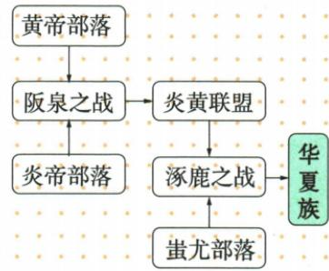

## 讲解

### 是什么

原书将五六千年前炎帝、黄帝的叙事置于“远古的传说”中，以部落联盟说明相关社会联系。传说是后人流传下来的叙事，可能保存古代活动的记忆，也可能包含演变和加工，不能与已经逐项核实的考古发现等同。

原资料叙事为：黄帝与炎帝在阪泉交战，炎帝失败后归顺，两大部落结盟；炎黄联盟随后在涿鹿与蚩尤部落作战，获胜后部分蚩尤部落归附，黄帝被推举为联盟首领。这一联盟逐渐演化为后来的华夏族。炎帝、黄帝被尊为中华民族的人文初祖，后人自称炎黄子孙。

### 怎么来的

将两次战争分开，才看得清叙事中的联盟形成过程：阪泉之战说明炎、黄之间由战争走向结盟；涿鹿之战说明联盟对外活动与吸纳其他部落，势力和声望进一步扩大。不能把“炎黄先结盟”与“涿鹿后扩大”颠倒，也不能把蚩尤部落当成黄帝的另一个名字。

原书流程图是整理传说的图示，不是当时形成的文献。读图应与正文一起核对：先理解阪泉之后炎黄结盟，再看涿鹿战争与联盟扩大，最后看华夏族形成的叙事联系。节点相邻不等于事件同时发生，前后顺序也不能自动代替因果解释。

“人文初祖”表达文化传统中的尊崇与认同，不能改写成已经通过遗传学证明所有人的直接生物学祖先。传说对研究文化记忆有价值，具体战役的年代、人数和经过仍需其他材料核验。

### 什么时候能用

用于区分阪泉、涿鹿，理解炎黄联盟与华夏族形成的原书叙事，或说明人文初祖、炎黄子孙等称谓。作答保留“传说、相传”的材料性质；不能据一幅后人流程图补出精确年份、兵力、战术或全部族群直接亲缘关系。

## 例题

**原例题缺口：**本课没有针对两次战争或人文初祖的独立原题、答案与详解，不补编。

**原资料材料（H3-S05、H3-S07）：**阪泉之战后炎、黄结盟；涿鹿之战后部分蚩尤部落归附炎黄联盟；这一联盟逐渐演化为华夏族。原图与正文共同呈现这些联系。

**材料解释补写：**这可以用来学习原书如何组织传说，但不是图中每一段都得到独立考古证实的证明。看到“形成过程”，先区分叙事先后，再明确它讲的是传说中的联盟与文化认同，不把流程图冒称当时的档案。

## 易错

- 把阪泉、涿鹿的参战方和作用互换：前者形成炎黄联盟，后者是联盟与蚩尤部落的战争叙事。
- 把文化称谓当成已核验的直接生物学世系：人文初祖的含义与遗传祖先不同。
- 将流程图节点相邻当成确定的因果：须核对箭头与正文，分清先后、联系和具体原因。

### 来源定位

- H3-S05：full.md（历史扫描分册1–50），L4050–L4060，炎黄传说、阪泉涿鹿之战与部落联盟；22fce0ae-e244-4784-abd1-7e1ac2556947_origin.pdf，实际PDF第35页。
- H3-S07：full.md（历史扫描分册1–50），L4111–L4128，华夏族形成原图及自动Mermaid错位连线；22fce0ae-e244-4784-abd1-7e1ac2556947_origin.pdf，实际PDF第35页。
