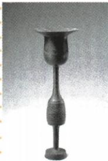

## 讲解

### 是什么

原资料介绍，山东日照东海峪遗址出土的蛋壳黑陶杯属于龙山文化；龙山文化是大汶口文化的后继者，距今约4400—3800年。蛋壳黑陶杯是蛋壳陶的代表，反映较高的制陶技术和生产力水平。

“考古文化”概括的是一组遗存的特征与联系。“后继者”在这里说明文化发展的前后联系，不能直接改写为已经证明的一个家族世系，也不能把所有黑色陶器都归到龙山文化。

### 怎么来的

确定器物归属，首先靠出土地点、年代及遗存组合，而不是只凭颜色。原题已注明山东日照东海峪与蛋壳黑陶杯，结合原书说明，才可定位龙山文化。器物名称与形态呈现精细制作的特点，它的价值在于保存了当时工艺与生产能力的线索。

为什么精致器物可研究生产力？制作器物需要材料选择、成形、加工、烧制等劳动环节，精细产品反映制作者的技术控制能力。这里补写的是工艺与能力的联系，不是说“器物漂亮”就证明社会必然富裕或已有国家。讨论社会等级，还要看使用、分配、墓葬或建筑等额外证据。

### 什么时候能用

题目明确给蛋壳黑陶杯及东海峪出土信息时，可答文化归属和工艺价值。若只给一件无名称、无出土地的黑陶，不能由颜色作唯一判断。原书“达到较高水平”是相对于史前生产条件的评价，不能改成“达到现代工业水平”。

## 例题

**原资料设问（H2-S07）：**图中文物属于哪一文化？其具有什么价值？

**原答案：**山东日照东海峪遗址出土的蛋壳黑陶杯属于龙山文化。龙山文化是大汶口文化的后继者，距今约4400—3800年。蛋壳黑陶杯是“蛋壳陶”的代表，表明当时社会生产力发展已经达到较高水平。

**解析补写：**第一问要求“属于哪一文化”，从图注器物名称及原文所给出土地联系龙山文化。第二问要求“价值”，说明它提供的工艺和生产力线索，不能只答“珍贵”。前后文化关系与年代可帮助定位，但并不是器物颜色独自测出了年代。原答未给出杯的具体用途和使用者身份，不补定为某位统治者的酒器。

## 易错

- 把黑陶杯答成半坡彩陶：器物特征、出土地点与文化定位要同时核对。
- 只写“好看、珍贵”：历史价值要落到可以研究的技术与社会问题。
- 从精细工艺直接推出国家或贵族身份：技术证据与政治、地位证据不能互相顶替。

### 来源定位

- H2-S07：full.md（历史扫描分册1–50），L3967–L3981，蛋壳黑陶杯所属文化与价值问答；22fce0ae-e244-4784-abd1-7e1ac2556947_origin.pdf，实际PDF第33页。
