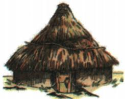

## 讲解

### 判据

材料给河姆渡干栏式建筑和半坡半地穴式房屋，问两种风格说明什么，或要求解释结构差异。看到“房屋结构”和“南北方”，应想到先辨结构，再联系环境需要，而不是仅给两个名称。

### 流程

1. **从图中找结构证据。**干栏式把居住空间架高；半地穴式有部分居住空间在地下。结构是图像可观察的信息，不是直接测得的气候。
2. **定位两地并补足背景。**河姆渡在长江下游，原书说潮湿温热；半坡在黄河流域，原书说干旱寒冷、风沙较大。背景来自所学和原解析，不能假称是凭两幅图测出温度、降水量。
3. **解释结构怎样应对需要。**架高有助于通风、防潮，减少蛇虫侵扰；半地穴式有助于挡风、保温。只有讲出这些作用，才完成环境与建筑之间的因果链。
4. **同时覆盖双方再概括。**两种环境提出不同需要，先民选择不同结构解决居住问题，因此本题概括为能够适应自然，不能只解释一幅图。
5. **逐项审查选项的证据。**房屋图不提供农具、栽培或产量信息，不能拿来判断农业技术；也没有木工技术比较标准，不能把“结构不同”直接夸为“技艺高超”。

## 例题

### 单元原题Q02：房屋结构与环境

**题干（H0-Q02）：**河姆渡遗址、半坡遗址分别反映了我国南北方农耕文明的特点。观察下面房屋复原想象图，二者迥异的风格说明（ ）

A. 自然地理环境相近

B. 当时农业生产技术先进

C. 先民木工技艺高超

D. 人类能够适应自然

**原图处理说明：**与实际PDF第36页核对，题中两种房屋与本课表格中的房屋图形一致；此处复用原资料本课相应图，完整保留结构和“复原想象图”标签。

**原答案（H0-A02）：**D。

**原解题思路：**河姆渡人生活在长江流域，气候潮湿温热，干栏式建筑既能通风防潮，又可防蛇虫之害。半坡人生活在黄河流域，气候干旱寒冷，风沙大，半地穴式房屋可以抵风挡雨和保温。这两种房屋结构的不同，是由不同的自然地理环境决定的，说明当时的人们已经能够适应自然环境。

**完整解析补写：**看到两幅房屋图，先观察居住空间怎样与地面相接：河姆渡架高，半坡部分位于地下。再结合两地环境，分别解释这些结构怎样减轻当地居住困难，最后把两项联系概括成适应自然。

- A错误：材料突出房屋结构差别，结合所学是适应不同环境；不能反过来得出环境相近。图像本身也不能测出气候的精确数值。
- B错误：房屋图没有农具、栽培或产量证据，不能由建筑差别判断农业生产技术“先进”。原题引言说农耕文明，不等于图像证明了农业技术的高低。
- C错误：图示可体现建造活动，却不能由“不同结构”独立判断木工技艺“高超”的程度；它没有解释两地为什么采用不同形式。
- D正确：架高居住有利于通风防潮，半地穴式有利于挡风保温，这两条环境需要与结构作用的联系说明了适应自然。

“环境影响”是此题的主要解释，不意味着房屋只受气候一个因素影响，更不能推导南北所有房屋必须采用同一种形式。

## 易错

- 把结构名称当成原因：只写“因为一处干栏式、一处半地穴式”仍在重复现象，须补环境需要和结构作用。
- 把复原图当现存完整建筑照片：图注明确为复原想象图，具体判断仍结合考古与课文背景。
- 把自然条件说成建筑形式的唯一决定因素：本题用环境解释主要差异，不能推广成所有地方无例外的规则。

### 来源定位

- H2-S04：full.md（历史扫描分册1–50），L3944–L3949，河姆渡稻作农业、建筑、生产生活；22fce0ae-e244-4784-abd1-7e1ac2556947_origin.pdf，实际PDF第32页。
- H2-S05：full.md（历史扫描分册1–50），L3951–L3959，仰韶、大汶口对比与半坡遗址；22fce0ae-e244-4784-abd1-7e1ac2556947_origin.pdf，实际PDF第33页。
- H0-Q02：full.md（历史扫描分册1–50），L4107–L4174，原题2房屋：L4107–4109及L4152–4174；22fce0ae-e244-4784-abd1-7e1ac2556947_origin.pdf，实际PDF第35–36页。
- H0-A02：full.md（历史扫描分册1–50），L4138–L4142，原题2原答案及原解题思路；22fce0ae-e244-4784-abd1-7e1ac2556947_origin.pdf，实际PDF第36页。
