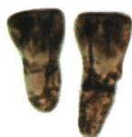
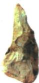
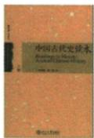
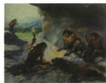

## 讲解

### 判据

题目给文物、读本、复原图或文字，问它属于什么史料、能研究什么、能否支持某结论。要先判断材料怎样形成，再检查题目结论是否超出了材料信息。

### 流程

1. **明确研究问题。**本课的问题是古人类生活。这个限定决定“直接留下”与“后人转述”的相对关系；研究对象变了，材料角色也可能变。
2. **读名称和图注。**“出土”“化石”“石器”指向实物遗存；“读本”提示后人编写；“复原”“想象”明确说明经过重建。不能因图画生动就跳过标签。
3. **按来源关系分类。**本题所示牙齿化石、石器是相关时代留下的第一手实物；读本和用火场景想象图是后来的叙述或重建。先判来源，再谈可信度，不能颠倒。
4. **把可观察信息接到所需判断。**牙齿形态与体质有关；人工加工痕迹与工具技术有关。回答价值时须把这条联系说出。若结论是人工取火、农耕或阶级分化，就需要对应证据，不能只用“一手史料”四字补上缺口。
5. **核对可靠性与结论强度。**确认材料年代、背景，并与其他证据相互验证。无法确定的部分保留限定，答案不得比材料更绝对。

## 例题

**原资料任务（H1-S09）：**根据图片并结合所学，谈谈史料有哪些分类。

①北京人牙齿化石

②北京人使用的石器

③《中国古代史读本》

④北京人用火场景想象图

**原资料分类答案：**第一手史料：①②。第二手史料：③④。

**原回答（原文照录；其中绝对化可信度表述已在讲解中纠正）：**

> 按照来源的不同,史学家兰克将史料分为一手资料和二手资料。兰克认为,对后世的研究者而言,历史事件的参与者或见证者是最有发言权的,他们所说的也是比较可信的,这是一手史料;并非亲身经历的,而是从别人著作中转述过来的那部分内容,则是二手史料。从类别看来,一手史料主要是指一些官方档案文献、当事人的书信回忆录等。一手史料是可信的、真实的,二手史料则值得怀疑,需要考证。

**逐项解析：**①依据“牙齿化石”，判断图示对象是相关时代留下的实物，可研究古人类体质。②依据“使用的石器”，判断是当时工具遗存，可研究加工和生产活动；没有用火方式的信息。③依据书名和读本形式，判断是后人整理的历史知识，研究北京人生活时属于第二手叙述。④依据“用火场景想象图”，判断是后人重建，能帮助理解可能的场景，但画面动作不是全部经考古独立证明的事实。这四项展示的来源类别，不能改写成“①②永远正确、③④永远错误”。原答中相关绝对化说法已在知识条目中保留并纠正。

### 单元原题Q04：考古发现与结论对应

**题干（H0-Q04）：**以下考古发现与结论对应正确的是（ ）

| 序号 | 考古发现 | 结论 |
| --- | --- | --- |
| ① | 北京人遗址：灰烬、烧石和烧骨等 | 会使用磨制石器 |
| ② | 山顶洞人遗址：穿孔骨针 | 会建干栏式房屋 |
| ③ | 门头沟东胡林遗址：距今约10000年至8000年的栽培粟和黍的遗存 | 早期农业出现 |
| ④ | 平谷上宅遗址：距今约7000年的陶器 | 贫富分化出现 |

A. ①

B. ②

C. ③

D. ④

**原资料标注：**2024北京中考改编。保留原书标注，不将改编题冒称已核验的原卷原题。

**原答案（H0-A04）：**C。

**原解题思路：**北京人会使用火，使用打制石器。山顶洞人已掌握钻孔和磨光技术，河姆渡人会建干栏式房屋。距今约1万年，我国先民会栽培水稻、粟、黍，早期农业出现。上宅遗址的陶器，在当时是生产工具和生活用具，未体现出贫富分化。

**完整解析补写：**每项先读“发现”，说明它能证明什么，再与右侧“结论”逐字核对。不能因为发现和结论都与史前历史有关就认为对应正确。

- A错误：灰烬、烧石、烧骨是用火的证据线索，与石器是否磨制不是同一个问题。原资料还明确北京人使用打制石器，故不能用这组发现证明磨制石器。
- B错误：穿孔骨针反映骨器加工、钻孔及缝衣等线索，没有房屋结构证据。干栏式房屋是原书河姆渡生活的内容，不能搬到山顶洞人骨针之后。
- C正确：材料明确是“栽培”的粟、黍遗存，不只是无法判定来源的野生植物；地点和约10000—8000年的年代提供背景，人工栽培粮食作物与早期农业判断直接相接。
- D错误：有陶器说明器物制作、使用等活动，却没有说明同一群体的人占有物品多少、墓葬待遇差异等。原题没有贫富对比，不能越过这个缺口宣布贫富分化。

③的栽培性质、年代和遗址是题干给定条件，本解析不自行测定它们；若另一题只给谷粒照片而未说明栽培，仍需额外鉴定。

### 单元原题Q05：研究中华文明起源的依据

**题干（H0-Q05，原书“新考法”题）：**研究中华文明起源最可信的依据是（ ）

A. 文字记载

B. 考古发现

C. 专家推测

D. 民间传说

**原资料标注：**2024天津中考。仅保留原书标注，未另行核验真题身份。

**原答案（H0-A05）：**B。

**原解题思路：**遗迹、遗址、遗物、出土文物等都是第一手史料，最为可信。

**完整解析补写：**看到研究对象是“文明起源”，想到本单元是史前社会，须比较四项能否直接提供那个时代的证据。已核定年代与出土背景的城址、墓葬、器物等，可直接用于研究农业、社会等级和政治组织，因而本题选考古发现。

- A不选：文字材料有价值，但关于史前文明起源的后世记载通常离所述时代较远，需要核验；本题没有给能与所研究时代直接对应的具体文字。不能据此否定所有时代的文字史料。
- B正确：考古发现提供相关时期的实物证据，能与原书良渚、陶寺的文明判断相接，是本题四项中最直接的依据。仍须核查真伪、年代、出土背景以及结论范围。
- C不选：专家推测是一种解释或待核验判断；身份权威不能代替证据。要问推测凭什么得出，而不是仅凭“专家”二字就采信。
- D不选：民间传说可能保存历史记忆、文化观念，但流传中会演变，具体情节需与其他材料核验，不能作为本题最直接的依据。

**原解析边界说明：**这里“最可信”是在本题四个选项和研究对象限定下比较，不是宣布所有出土物都无需鉴别。原解析中第一手材料的绝对化表述须依史料核验原则加上这一边界。

### 九上第一单元原题5完整原答与解析

**单元原“新考法”材料题，原书标注2024浙江中考节选；仅有（1）小问，未另核真题身份。**

材料一：人类古老的文明有四种，都是沿着江河发祥的。其中，中华文明是唯一的从未中断过的文明。今天生活在这片土地上的人就是那创造古老文明的先民后裔，在这片土地上是同一种文明按照自身的逻辑演进、发展，并一直延续下来。同时，中华文明在发展过程中显示了巨大的凝聚力……对中华文明共同祖先炎、黄二帝的崇拜，使中华文明在多元发展的同时，一以贯之地保持了连续性。……探讨中华文明延续不断的原因，我们注意到古代典籍所载中华文明中“自强不息”（即努力向上不停止）和“厚德载物”（即宽厚的德行可以承载万物）的精神，使这个文明既有刚性又有韧性。

——摘编自袁行霈等《中华文明史》。

**原问（1）。**据材料结合所学，写出沿江河发祥的世界四大古老文明，并指出文中哪些属于文献史料。

**完整原答案。**文明：古埃及文明、古代两河流域文明（或古巴比伦文明）、古代印度文明、中华文明。史料：“自强不息”“厚德载物”。

**完整推理。**第一任务问文明名称，结合本单元三课古埃及、两河、古印度，再接已有中华文明，列四项；两河范围比古巴比伦宽，但原答允许两种措辞，不由允许简称抹去苏美尔等其他历史。河流背景可帮助对应尼罗、幼发拉底及底格里斯、印度河和中国早期流域，却不以河名代问的文明名。第二任务先看“古代典籍所载”，两句格言以文字保存，题目指定的文献史料是自强不息、厚德载物，不是本题遗址照片或猜原图。材料作者用典籍引语说明精神传统，不能只答《中华文明史》书名而漏题内被引的两句。

**分类与范围。**摘编的现代研究著作也是文献载体，但问“文中哪些”时原答案指其中援引的古代典籍文字，需分引用文本与研究者的解释。字面有文献不等每条判断均未经核验就真实；第一手第二手还须看研究对象与形成时代，本问只要求形式分类。原“唯一未中断”在所列古老文明的连续性论述中保留，不外推其他地域人群灭绝、遗迹全消失，也不等中华文明自古每一制度都从未变化。题号（1）保留，节选未提供其他小问，不编（2）或补一套不存在的原答案。

### 九上第四单元大化改新叙述解释原题及四项解析

**原新考法历史解释选择，原无总数字序号，覆盖记第4题。**646年孝德天皇颁布《改新之诏》，推行改革，史称大化改新。它是日本社会政治经济大变革，是由奴隶社会向封建社会过渡的标志。上述文字分别属于（）。

A.历史叙述和历史解释；B.历史结论和历史解释；C.历史观点和历史事实；D.历史叙述和历史事实。

**原答案A，完整原解。**历史叙述以文字语言图片等载体描述事件人物；历史解释阐明发展变化原因意义等，带解释者主观色彩。本题前后分别为叙述、解释。

**逐项解析。**先将原文分两部分：前部有年、人物、颁诏推行改革动作，是描述发生了什么；后部“变革”“过渡标志”给性质意义判断，是解释事件说明什么。A正确，顺序和两类都符合。B不选，第二类对，第一部具体行动叙述不能改成整体结论。C不选，两部分方向相反，前部不是只提出观点，后部包含意义判断不能仅当原始事实列举。D不选，前部对，后部标志及社会性质为解释而非只给事件动作。解释带主体认识不等随意编造或完全无依据，仍应由改革措施和社会变化支持；叙述形式也不自动保证每条所述准确，是否可信还要核史料。历史叙述解释是表达内容的区分，实物文献则是载体类型，不能把两个分类当同一层。

## 易错

- 用印刷载体代替材料本体：照片印在读本中，不等于照片所展示的出土文物也是后人编造。
- 答“有价值”却不说用于研究什么：应补上与材料内容相对应的问题，如体质、工具制作。
- 把研究者的推测当作遗址直接发现：推测要说明依据和不确定处，不能借第一手材料的身份越过推理。

### 来源定位

- H1-S02：full.md（历史扫描分册1–50），L3773–L3787，元谋人上门齿化石与价值设问及原答；22fce0ae-e244-4784-abd1-7e1ac2556947_origin.pdf，实际PDF第30页。
- H1-S09：full.md（历史扫描分册1–50），L3851–L3875，四幅史料图片分类、原答及需纠正的可信度说明；22fce0ae-e244-4784-abd1-7e1ac2556947_origin.pdf，实际PDF第31页。
- H0-Q04：full.md（历史扫描分册1–50），L4222–L4234，原题4考古发现与结论：题干表格与选项；22fce0ae-e244-4784-abd1-7e1ac2556947_origin.pdf，实际PDF第36页。
- H0-A04：full.md（历史扫描分册1–50），L4148–L4150，原题4原答案及原解题思路；22fce0ae-e244-4784-abd1-7e1ac2556947_origin.pdf，实际PDF第36页。
- H0-Q05：full.md（历史扫描分册1–50），L4236–L4244，原书新考法题：研究文明起源的依据；22fce0ae-e244-4784-abd1-7e1ac2556947_origin.pdf，实际PDF第36页。
- H0-A05：full.md（历史扫描分册1–50），L4246–L4248，原书新考法题原答案及原解题思路；22fce0ae-e244-4784-abd1-7e1ac2556947_origin.pdf，实际PDF第36页。
- WA-U05：full.md（历史扫描分册251-300），L58–L66，新考法原材料文献史料原问原答完整；5dc2c8da-0729-4435-bf9a-d7b79d1838b6_origin.pdf，实际PDF第1页。
- WA-U04：full.md（历史扫描分册251-300），L1385–L1397，大化改新历史叙述解释新考法四项原答完整原解；5dc2c8da-0729-4435-bf9a-d7b79d1838b6_origin.pdf，实际PDF第20页。
