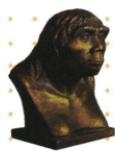
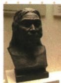
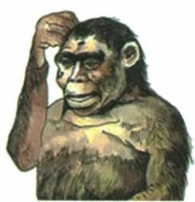
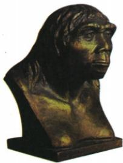
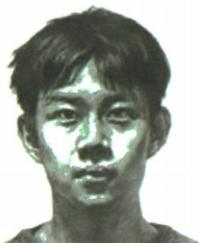

## 讲解

### 判据

题目同时给出北京人、山顶洞人的头像、生活资料或比较表，要求判断异同。入口是找到要求比较的项目，再用同一标准分别核对两者；不能只凭“早、晚”推断全部差异。

### 流程

1. **先锁定对象。**北京人约70万—20万年，山顶洞人约3万年，二者都与周口店有关。地名相近不等于同一种古人类，用图注、年代或洞穴位置进一步区分。
2. **确定比较项目。**若问头部，只比较体貌；若问工具，再核对石器、骨器和加工技术。这样能避免用头像回答农业问题。
3. **逐项给出证据和判断。**体貌上，北京人仍保留猿的某些特征，山顶洞人具有现代人类特征。工具上，两者都使用打制石器，山顶洞人又掌握磨光、钻孔。共同项不能被“山顶洞人更晚”遮掉。
4. **保留不同强度的用火表述。**北京人已经会使用火；山顶洞人可能知道人工取火。后一句不仅谈是否用火，还谈获得火的方式；应保留“可能”，不能改成对两者技术的绝对排名。
5. **检查结论有没有跨项目。**外貌变化可说明体貌差别，却不能直接证明农耕定居。需要说明进步时，应指出具体技术或特征，不写笼统的“什么都更先进”。

## 例题

**原资料设问（H1-S06）：**通过北京人、山顶洞人的复原头像，说说北京人和山顶洞人的头部呈现怎样的进化特征。

**原答案：**北京人保留了猿的某些特征；山顶洞人已经具有现代人类的特征，模样和现代人相同。

**完整思路：**看到两幅图的名称，先分别确定对象；看到问题限定“头部”，想到应从外形特征比较。北京人头像所表现的眉骨、额部、嘴部等与原书体貌说明相符，山顶洞人头像则表现现代人类的头部特征，所以答案必须分别说出两者，才能形成有效比较。“进化特征”在这里描述阶段上的体貌差别，不能仅凭头像证明北京人就是山顶洞人的直接祖先。也不能从两幅头像判断用火方式、工具种类和房屋类型。

### 单元原题Q01：北京人的特征

**题干（H0-Q01）：**比较“古猿头像”“北京人头部复原像”“现代人头像”图片可知，北京人（ ）

A. 仍然保留猿类特征

B. 能够使用磨制石器

C. 完全具备现代人特征

D. 开始了原始农耕生活

**原资料标注：**2023湖南邵阳中考。保留原书标注，未另行核验真题身份。

**原答案（H0-A01）：**A。

**原解题思路：**北京人与现代人差别较大，与古猿的形态相似，山顶洞人模样和现代人相同。北京人使用打制石器，未开始从事农业生产。

**完整解析补写：**题干要求比较头像，判断入口是体貌，不能只看到“北京人”就把所有所学特点拿来填。北京人头部复原像的眉骨、额部、嘴部等与现代人头像有明显差别，与古猿有某些相似之处，符合本课北京人体貌说明。

- A正确：“仍然保留猿类特征”与头像比较及原书体貌说明相符；这里是某些体貌特征，不是把北京人判为古猿。
- B错误：北京人使用的是打制石器，且头像本身不提供工具证据。不能从面部直接判断磨制石器技术。
- C错误：“完全具备现代人特征”与比较中仍有原始体貌特征不符，也把北京人与山顶洞人的口径混淆。
- D错误：原资料写北京人尚未开始农业生产；头像也不能证明原始农耕。因此不是本题由图能够得到的结论。

先用题中图像判断，再用对应知识核对范围，才能同时避免体貌混淆和证据跨项目。

## 易错

- 把两者都写成“会使用磨制石器”：材料说共同使用打制石器，山顶洞人的磨光钻孔不能替换这一共同点。
- 只写山顶洞人，漏掉北京人：比较题要用同一项目交代双方，否则没有说明差异。
- 把复原像当原始化石：它是依据研究制作的形象，观察时须遵守图注与题目范围。

### 来源定位

- H1-S06：full.md（历史扫描分册1–50），L3828–L3839，北京人与山顶洞人复原头像比较设问及原答；22fce0ae-e244-4784-abd1-7e1ac2556947_origin.pdf，实际PDF第31页。
- H1-S08：full.md（历史扫描分册1–50），L3845–L3849，北京人与山顶洞人对比表；22fce0ae-e244-4784-abd1-7e1ac2556947_origin.pdf，实际PDF第31页。
- H0-Q01：full.md（历史扫描分册1–50），L4066–L4105，原题1北京人体貌：题干图与选项；22fce0ae-e244-4784-abd1-7e1ac2556947_origin.pdf，实际PDF第35页。
- H0-A01：full.md（历史扫描分册1–50），L4132–L4136，原题1原答案及原解题思路；22fce0ae-e244-4784-abd1-7e1ac2556947_origin.pdf，实际PDF第35页。
