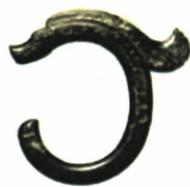
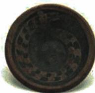
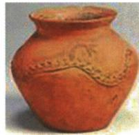
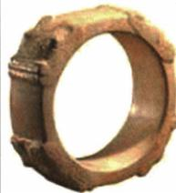

## 讲解

### 判据

材料并列不同地区的遗址和器物，同时强调相近元素或联系，问文明起源特点。关键线索有两组：不同地区、不同器物体现多样性，共有文化因素体现联系；只用其中一组会把多元一体讲薄。

### 流程

1. **保留材料提供的空间差异。**先读遗址与省区，不能把四件器物归成同一个地点。“不同地区”是多元的依据。
2. **比较对象与共性。**器物材质、形态不同，说明各具特色；题干明确都有龙元素，说明有共享、关联的文化要素。不要因共同纹样就说器物完全相同。
3. **把观察接到历史概念。**结合本课不同地区文化交流、融合的认识，将多样性与共同因素合起来，判断多元一体。不是看到“龙”字就机械套词。
4. **逐项问证据是否足够。**地理因果需要环境与结果对照；用途变化需要前后比较；等级分化需要同背景中资源、身份差异。材料未给这些证据，不能把它们硬补进去。
5. **检查结论范围。**这组材料可帮助概括文明联系，不独自证明政治统一、唯一源头或精确传播路线。回答“不选”时说的是本题证据不支持，不等于那个观点在任何情况下都错误。

## 例题

### 单元原题Q03：多地器物中的龙元素

**题干（H0-Q03）：**下表为我国不同地区出土的新石器时代的器物，这些器物均有“龙”的元素。这说明（ ）

| 三星塔拉遗址 | 陶寺古城遗址 | 齐家文化遗址 | 良渚古城遗址 |
| --- | --- | --- | --- |
|  |  |  |  |
| 红山玉龙（内蒙古） | 彩绘龙纹陶盘（山西） | 凸堆龙纹红陶罐（甘肃） | 龙首纹玉镯（浙江） |

A. 地理环境影响人类文明发展

B. 器物的生活化功用加强

C. 中华文明具有多元一体特征

D. 当时社会阶级分化明显

**原答案（H0-A03）：**C。

**原解题思路：**在三星塔拉遗址、陶寺古城遗址等的考古发现中都出现了“龙”的元素，说明中华文明起源和初步发展具有多元一体的特征。

**完整解析补写：**题目同时强调“不同地区”和“均有龙元素”。前者指向多地文化各有发展与特色，后者提供共有文化因素的联系；两项要一起解释，才能对应多元一体。

- A不选：地理环境会影响文明，但本材料没有提供环境条件与发展结果的因果对照，不能用一个一般正确命题替代对这组器物的解释。
- B不选：“加强”需要前后用途的变化比较，材料只给器物及龙元素，没有提供用途改变的证据，也不能把礼仪或装饰器物一律判成生活化用途。
- C正确：不同地区、不同形态与材质的器物共有龙元素，结合本课文化交流、融合背景，对应既有多样性又有共同联系。
- D不选：精美器物本身不提供同一社会不同人群资源、地位的比较；材料没有等级墓葬等差异证据，不能推出阶级分化明显。

这道题支持文明特征的概括；四件器物有共同元素，不等于已证明同一政权统治四地，也不独自确定每条传播路线。

## 易错

- 只写“多地出土，所以多元”而漏共有因素：本题同时强调龙元素，须解释联系。
- 选一般正确却缺乏本题证据的选项：判断要回到题干，不按口号熟悉程度选择。
- 从不同精美器物直接推出阶级：没有同群体等级对比，不足以支持该结论。

### 来源定位

- H3-S01：full.md（历史扫描分册1–50），L4001–L4025，玉猪龙和陶寺龙纹陶盘的文化特征问答；22fce0ae-e244-4784-abd1-7e1ac2556947_origin.pdf，实际PDF第34页。
- H3-S04：full.md（历史扫描分册1–50），L4046–L4048，良渚陶寺遗址、考古证据及多元一体意义；22fce0ae-e244-4784-abd1-7e1ac2556947_origin.pdf，实际PDF第34页。
- H0-Q03：full.md（历史扫描分册1–50），L4176–L4220，原题3多地区龙元素器物：题干图注与选项；22fce0ae-e244-4784-abd1-7e1ac2556947_origin.pdf，实际PDF第36页。
- H0-A03：full.md（历史扫描分册1–50），L4144–L4146，原题3原答案及原解题思路；22fce0ae-e244-4784-abd1-7e1ac2556947_origin.pdf，实际PDF第36页。
