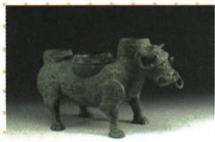

## 错法

观察牺尊，只看牛鼻穿环便说“图中直接描绘牛拉犁，单靠此图已经证明牛耕普及”。错在把驯牛方法跳成具体耕作活动，再把一件器物跳成全国普及。原答案将鼻环、驯牛和牛耕放在一起，容易使学生忽略哪些是画面可见，哪些是结合时代知识作出的联系。

## 正解

鼻环直接支持穿鼻驯牛的认识；若要说明牛耕，则联系春秋后期农业使用牛力的时代知识及相应证据。器物图没有犁、田地或拉犁场景，不能声称这些已在图中出现。将可见事实—可支持的解释—结合所学的结论分开，才能完整答题而不夸大证据。

上海博物馆将这件牺尊的鼻环称为研究牲畜驯化的材料，支持上述范围区分。此处保留原答案，同时补足推理边界，并不否认春秋后期出现牛耕这一课内知识。[核查：上海博物馆“牺尊”](https://www.shanghaimuseum.net/mu/frontend/pg/article/id/CI00000404)

## 例题

**原资料设问（H5-S02）：**观察图片中的青铜器，你可以获得什么信息？

**原答案：**这件春秋时期的青铜器整体为牛形，牛鼻上穿有一环，说明当时人们已经开始用穿鼻的方法来驯服牛了，也已经出现牛耕，生产力进一步发展。

**证据边界与完整解析补写：**先读器形和鼻环，鼻环直接支持穿鼻驯牛的认识。上海博物馆对该牺尊也将鼻环说明为牲畜驯化史的实物资料。牛被驯服并不自动表示图片已经描绘拉犁耕田；“春秋后期出现牛耕”的时代知识需结合其他材料。原答案中的牛耕结论保留为结合所学的说明，不能把它改说成仅由鼻环即可单独证明。[核查：上海博物馆“牺尊”](https://www.shanghaimuseum.net/mu/frontend/pg/article/id/CI00000404)

### 来源定位

- H5-S02：full.md（历史扫描分册1-50），L4500–L4514，牺尊原图、观察设问与原答；22fce0ae-e244-4784-abd1-7e1ac2556947_origin.pdf，实际PDF第40页。
- H5-S05：full.md（历史扫描分册1-50），L4524–L4526，春秋农业、手工业、商业；22fce0ae-e244-4784-abd1-7e1ac2556947_origin.pdf，实际PDF第40页。
