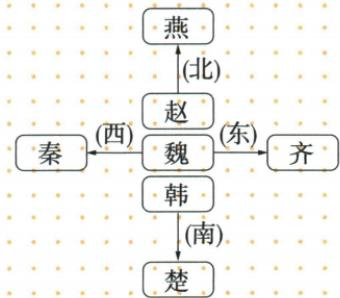

## 讲解

### 是什么

战国七雄指齐、楚、燕、韩、赵、魏、秦七个势力较强的诸侯国。战国是东周后期，本书以公元前475年至前221年为这一阶段。七雄是国家，春秋五霸是先后取得霸主地位的君主或其国家，不能把两种称呼简单当作“春秋有五国、战国有七国”的全部国家数。

### 怎么来的

春秋长期纷争中，中小诸侯国被吞并，强国扩张；进入战国，晋国被韩、赵、魏三家大夫瓜分，齐国君位被田氏取代。前者改变国家格局，形成三个主要强国；后者是齐国统治者家族变化，不是凭“田”字增加第八雄。旧有王室、诸侯和卿大夫之间的等级关系因此受到进一步破坏。

战争由争夺霸主地位转向兼并土地与国家，规模、参战兵力、交战区域和持续时间增大。原书列桂陵、马陵、长平之战，并说魏、楚、齐、秦等先后崛起，这说明长期并存不等于七国实力始终相等。各国为在竞争中取胜，又推动富国强兵的改革；兼并与改革是相互联系的政治过程。

### 什么时候能用

判断七雄名称、地理相对位置、战争特征与战国改革背景时可用。原地理图是记忆示意，不能作为实际比例尺地图算距离、面积和边界；魏、韩、赵大体在中间，“齐楚秦燕赵魏韩，东南西北到中间”用于大体方位，不说明每国领土全在一条正方向线上。

## 例题

**原资料对照材料（H6-S08，非另编试题）：**

|类别|春秋五霸|战国七雄|
|---|---|---|
|存在关系|先后存在|长期并存|
|历史时期|奴隶社会瓦解时期|封建社会形成时期|
|战争性质|争霸战争|兼并战争|
|战争特点|时间较短，规模较小|时间长，规模大，更加残酷|
|与周天子的关系|诸侯仍然承认周天子的地位|诸侯称王，周天子已无足轻重|

**辨析补写：**先比较名称的含义：霸主着重盟主地位，七雄着重并存的强国。再比较战争目标：春秋争夺诸侯主导地位，战国更着重吞并土地与国家。战国战争的兵力、战场与持续时间通常更大，不把原表概括读成每一场春秋战役都比每一场战国战役短。承认周天子名义地位也不等于周王实际控制诸侯；社会性质采用本书初中学习口径，不能仅凭战争大小给每个地区确定同一转型日期。

资料未为七雄地理图提供独立完整题；以上保留原图及原对照表，明确其记忆与辨析用途。

## 易错

- 将韩、赵、魏说成商鞅变法分出的国家：其形成与三家分晋相联系。
- 将田氏代齐说成齐国更名“田国”：变化的是统治家族。
- 把七雄图箭头看作征服路线：原图表示方位，不表示谁灭谁。

### 来源定位

- H6-S01：full.md（历史扫描分册1-50），L4558–L4600，战国七雄形成、兼并战争及地理图；22fce0ae-e244-4784-abd1-7e1ac2556947_origin.pdf，实际PDF第41页。
- H6-S08：full.md（历史扫描分册1-50），L4648–L4650，春秋五霸与战国七雄对照原表；22fce0ae-e244-4784-abd1-7e1ac2556947_origin.pdf，实际PDF第42页。
