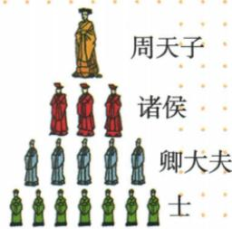

## 讲解

### 是什么

西周分封制是周王依据血缘关系远近和功劳大小，把宗亲、功臣等分封到地方，授予管理土地和民众的权力，建立诸侯国的制度。受封诸侯具有一定独立性，可在封地内再分封；同时必须向周王进献贡赋，军队服从周王调遣。权利与义务是一组配套关系，不能只记“分地”。

周天子—诸侯—卿大夫—士构成原书所列贵族等级。这个图表示贵族等级，不是全国人口全部社会身份的清单；“士”不能因为处在图最下层就改叫奴隶。

### 怎么来的

周初面临巩固新政权、扩大控制范围的问题。周王通过宗亲和功臣组织地方治理，让受封者管理土地与民众；受封者获得资源，又用贡赋与军事服从维系同王室的联系。这解释了分封为何能稳定周初政治形势：地方有管理者，周王也有支持其统治的资源与军力来源。

再分封使上述关系延伸到诸侯国内部，形成层层相连的等级秩序。但“诸侯有一定独立性”也意味着地方并非由周王逐件直接管理。制度的早期作用与后来的变化须分时段认识：它能在周初加强控制，不等于永远排除地方坐大；到王室实力削弱、诸侯不履行义务时，原有联系便受到破坏。不能用后来瓦解否定早期作用，也不能用早期稳定否认后来变化。

### 什么时候能用

题目出现受封对象、封地、诸侯国、贡赋与服从调遣，便可判断分封制。判断影响必须接题干：等级图强调等级秩序；器物和制度传播强调文明扩展；义务与王室支持关系强调地方控制。不能把每一道分封制题都只答“巩固统治”。

## 例题

**原资料设问（H4-S04）：**图片反映的是西周实行的哪一等级制度？

**原答案：**分封制。

**完整解析补写：**图中由周天子到诸侯，再到卿大夫与士，呈现贵族层级；结合本课周王分封、诸侯再分封的内容，可知层级同分封制度相接。仅凭人数或服饰不能独立确认制度，判断还依赖图中文字与西周时段。回答制度后，如问义务，应补贡赋和军队调遣，不能用等级名称代替义务。

### 西周与西欧分封异同的跨章原表

**原比较表，非独立设问。**

|维度|西周原概括|西欧原概括|
|---|---|---|
|纽带|血缘关系|土地封赐|
|社会形态|奴隶社会|封建社会|
|权利关系|受封者对周天子负责|封君封臣依次互为主从|

**完整相同点。**都通过土地分封；规定双方权义；促等级制度；一定时期形成较稳定秩序。

**完整分析。**比较要用同一维度：土地都分，但原纽带侧重不同；西周原前课按血缘远近和功劳分宗亲功臣，不能把本表主要血缘概括改成从无非血缘受封者。西欧将具体封赐关系及权义联结起来，依次主从不同天子统一负责的原概括。相似土地形式不能抹社会形态差别；前期秩序较稳说明双方权义有组织作用，不等制度永远稳固或从无冲突。原比较为初中概括，各时段具体权力仍须具体材料，不能照金字塔外形就断中外全部制度完全一样。

### 九上第三单元两制度与庄园原题的完整对照

**原新考法综合探究，原无数字总题号，覆盖记第3题。**李老师开展“对比东西方文明”探究，完成任务。

**任务一，原问(1)：结合所学，分别写出图一图二对应制度名称，分析两制度异同。**

**完整原答(1)。**图一分封制，图二封君封臣制。不同点：联系纽带不同，前者以血缘关系、后者以土地封赐为纽带；前者所有被分封者对周天子负责，后者封君封臣依次互为主从。相同点：都通过分封土地实现；促进等级制；一定程度巩固统治秩序；规定分封者与受封者权利义务。

**完整解析(1)。**图一人物分层授封联系西周原制度，图二贵族间“给予土地和保护”“效忠和提供军队”对应封君封臣相对关系。比较先固定同一维度：纽带对纽带，负责关系对负责关系。西周主要血缘纽带不等只有同姓能受封，原七上还给功臣等；所有被分封者负有对天子义务是原制度概括，不等后世任何时期天子都有效控制所有地方。西欧每对双方一方授地保护、另一方效忠军役，依次互为主从，不能让最上国王自动成为所有下层人物的直接封君。图底农民获耕地、服劳役耕种与贵族封臣军役不同。再比较实现途径、等级、统治作用、权义四同点，不能只说“都是分封”便漏三项。原“一定程度”保局限，土地层级秩序并非保证永远统一。

**任务二原材料。**东汉豪强大族庄园“有煮盐、冶铁、酿造、纺织等作坊，能满足田庄基本生活要求”；西欧庄园“有住房、冶铁等作坊，奶酪、火腿、鞋帽、衣服等自己制作”。

**原问(2)：根据材料，谈谈东汉与西欧庄园共同点。原答(2)：经济上自给自足。**

**完整解析(2)。**两材料都给内部生产生活用品，东汉明确满足基本生活、西欧列食物衣用品自己制作，把不同物品列表归纳成共同经济方式：主要内部生产满足内部需要。自给自足不等产出物品一模一样，也不等绝无任何外部交换。材料只支持经济共同点，不能由有作坊便推人身身份、土地法律、法庭权利和政权结构全部一样；制度任务与经济任务须分别回答。

## 易错

- 把受封后的诸侯说成没有权力：其管理土地、民众并具有一定独立性，正是制度内容。
- 把一定独立性说成无需服从周王：权利并未取消贡赋、军事服从等义务。
- 将分封与郡县管理互换：本课分封允许再分封，不能改成国君逐级直接任免所有地方官。

### 来源定位

- H4-S04：full.md（历史扫描分册1-50），L4420–L4453，武王伐纣、分封制、利簋及等级图设问；22fce0ae-e244-4784-abd1-7e1ac2556947_origin.pdf，实际PDF第39页。
- WF7-S05：full.md（历史扫描分册251-300），L706–L708，西周与西欧分封异同完整比较表；5dc2c8da-0729-4435-bf9a-d7b79d1838b6_origin.pdf，实际PDF第11页。
- WF-U03：full.md（历史扫描分册251-300），L1008–L1053，东西制度两图及庄园经济材料两问完整原答；5dc2c8da-0729-4435-bf9a-d7b79d1838b6_origin.pdf，实际PDF第15页。
