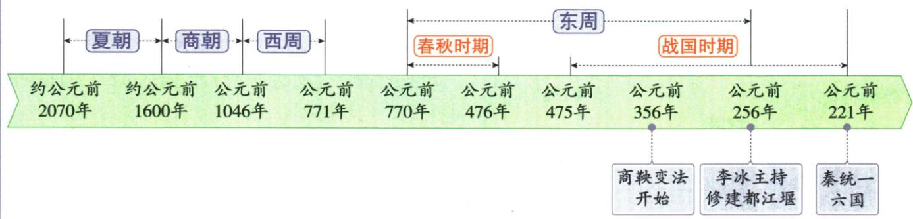

## 讲解

### 是什么

公元前1046年，周武王统率联军与商军在牧野决战，获胜后占领商都朝歌，商朝灭亡；周武王建立周朝，定都镐京，史称西周。公元前771年西周灭亡，前770年周平王东迁洛邑，东周开始。西周、东周是周朝的两个阶段，“东”与“西”与都城位置变化相联系。

### 怎么来的

周人位于陕西渭水流域周原一带，以农业立国并逐渐扩张；周文王在吕尚等人辅佐下准备灭商。商末国力消耗与民众困苦削弱旧王朝，周人发展和联军组织增强挑战者，牧野之战是两种力量变化的直接军事表现。因此“商亡”和“西周建”要放在同一更替过程中理解，不能把战役孤立成一组日期。

战争获胜并不自动解决辽阔地域的治理。周王朝建立后，周公营建洛邑，加强对东部地区的控制，并通过分封诸侯组织地方统治。它把建立政权后的管理问题接到制度建设上。后来地方诸侯增强、王室实际控制力削弱，使同一个周朝内部的权力关系发生变化；东迁是阶段转换的重要标志，不等于从此周天子的名义地位立即消失。

### 什么时候能用

遇到周武王、牧野、镐京、周平王、洛邑，要先确定是在问王朝建立还是周朝内部阶段。时间比较时公元前年份数越大越早，前1046年早于前771年；前771年与前770年不能互换。讲兴衰须区分本课给出的事实与材料没有展开的经过，不凭“国人暴动”的事件名称补造题目条件。

## 例题

**原资料对照材料（H4-S05，非另编试题）：**

|朝代|建立时间|灭亡时间|都城|开国之君|亡国之君|重要事件|
|---|---|---|---|---|---|---|
|夏|约公元前2070年|约公元前1600年|阳城（早期）|禹|桀|世袭制取代禅让制|
|商|约公元前1600年|公元前1046年|亳，后几次迁都，盘庚时迁到殷|汤|纣|盘庚迁殷、武王伐纣、牧野之战|
|西周|公元前1046年|公元前771年|镐京|周武王|周幽王|分封制、“国人暴动”|
|东周|公元前770年|公元前256年|洛邑|周平王|—|三家分晋、田氏代齐|

**对照解析补写：**先看朝代，再把同一行的建立者、年代和都城配对。夏、商的建立时间保留“约”；西周建立与商灭亡同在公元前1046年，是新旧王朝更替，而非同一位君主改名。西周与东周都是周朝的阶段，公元前771年、前770年分别是西周灭亡和东周开始。原表没有给东周亡国之君，不自行补入姓名。

**读图解析补写：**原轴将东周覆盖春秋及战国的一部分，而战国延续到前221年。原表东周结束于前256年，战国结束于前221年，两者对象不同，不构成必须改成同一年的矛盾。不能把“东周后期为战国”误读为东周与战国起止完全相同。

## 易错

- 把洛邑写为西周最初都城：西周定都镐京，洛邑在东部治理及后来东迁中起作用。
- 把周朝总称与西周阶段互换：商被周取代，但前771年结束的是西周阶段。
- 认为年代数字越大越晚：公元前纪年从较大数字走向较小数字。

### 来源定位

- H4-S04：full.md（历史扫描分册1-50），L4420–L4453，武王伐纣、分封制、利簋及等级图设问；22fce0ae-e244-4784-abd1-7e1ac2556947_origin.pdf，实际PDF第39页。
- H4-S05：full.md（历史扫描分册1-50），L4463–L4465，四阶段更替原表；22fce0ae-e244-4784-abd1-7e1ac2556947_origin.pdf，实际PDF第39页。
- U2-S00：full.md（历史扫描分册1-50），L4250–L4347，单元原体系图与时间轴；22fce0ae-e244-4784-abd1-7e1ac2556947_origin.pdf，实际PDF第37页。
