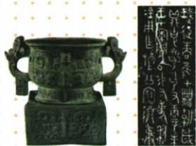

## 讲解

### 判据

题目同时给器物、铭文与史书记载，问史料类型或价值，应先区分原器物、铭文内容和后来对它的解释。利簋是西周青铜器，其铭文记录武王征商，是研究商周更替的直接材料；写真图片是帮助观察原器物的载体，图片中的说明文字不是西周人留下的全部铭文。

### 流程

1. 确定年代和出处。属于事件时代的原器物及记录，可作为第一手史料；不能因材料在新书里展示就把原器物改称新书作者创作。
2. 提取铭文实际涉及的事件与时间信息。利簋关联武王征商和甲子日清晨，先把可读内容限定到这一事件。
3. 对比文献是否讲同一事件、时间或过程，相合部分可以互相印证。国家博物馆介绍了它与文献中甲子日清晨伐商的记载相参照的价值。[核查：中国国家博物馆“利”青铜簋](https://www.chnmuseum.cn/zp/zpml/kgfjp/202108/t20210802_250931.shtml)
4. 表述结论：为商周更替提供第一手实物材料，并能同文献互证。不得扩大成利簋单独记下商朝全部历史，或铭文已直接写出“公元前1046年”这一现代纪年。

第一手不等于每种解释均无争议；需联系铭文释读、年代及其他证据。互证也不等于拿现代题解重复原书当作第二份独立古代证据。

## 例题

**原资料设问（H4-S04）：**图片青铜器属于什么史料？说出其重要价值。

**原答案：**第一手史料。利簋腹内的铭文记载了周武王在牧野伐纣的时间，为研究商周的更替提供了第一手史料，为史书记载提供了实物依据。

**完整解析补写：**看到原器物及铭文，先判断其与事件的时代联系；再由铭文记录武王征商，找到它同商周更替的对应。答案“提供实物依据”要说明是铭文中相关事件、时间信息可与记载参照，而不是器物只要古老就能证明任何史书。原答案保留；补充边界为日序记载与现代绝对纪年不可直接等同。

## 易错

- 看到拓片就说原器物是后人想象：拓片呈现器内文字，应区分呈现载体与原始记录。
- 写“甲子”便当作已直接得到公元前1046年：还需要年代研究与其他证据。
- 把第一手理解为所有释读绝对可靠：史料类型和具体结论的可靠程度是不同判断。

### 来源定位

- H4-S04：full.md（历史扫描分册1-50），L4420–L4453，武王伐纣、分封制、利簋及等级图设问；22fce0ae-e244-4784-abd1-7e1ac2556947_origin.pdf，实际PDF第39页。
