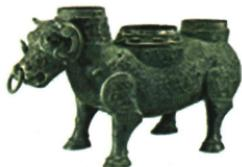
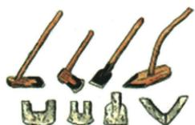
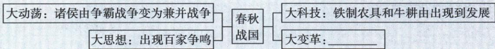

## 讲解

### 判据

同题同时给生产工具、诸子思想和变法材料，要求分问判断或归纳时代主题，要分别识别每组信息，再说明共同背景。不能把某组信息直接搬到另一问，也不能只背社会大变革而不指出具体变化。

### 流程

1. 给材料按领域定位：工具、动力属生产；学派著述属思想；土地、耕织属经济政策；争霸兼并属政治军事。先区分对象才能防止答案错位。
2. 读设问限制。“根据材料”先提取可见或可读信息，“结合所学”可补课内对应知识，“任选一人”不要求列遍所有代表。
3. 对图形和文字分别解释证据。铁工具对应生产工具，鼻环先对应驯牛；结合所学才接牛耕。引文中的行为对应政策，不把政策全集硬塞进只问部分措施的一问。
4. 每问接出因果：工具、动力改善生产条件；变法调节土地与激励，提高国家资源组织和供给；现实问题、人才和传播条件推动思想活跃。
5. 如问共同主题，再将政治经济思想等变化接到本书所述奴隶社会向封建社会的转型。多方面相互联系而非同一天完成，概括不抹去各地具体过程。

## 例题

### 原题6：社会大变革的多组材料

**原题（U2-Q06）：**春秋战国时期是我国历史上一个社会大变革的时期。阅读材料，完成下列要求。

**材料一：**

|图1 春秋晚期牺尊|图2 战国时期铁农具复原图|
|---|---|
|||

**材料二：**战国时代，诸子百家之学异常活跃，极富创造力，被公认为中国思想文化史上灿烂辉煌的时代。——颜世安《从“稷下学宫”看战国百家争鸣》

**材料三：**夫商君为秦孝公决裂阡陌，劝民耕农利土。是以兵动而地广，兵休而国富，故秦无敌于天下。——摘编自司马迁《史记》

（1）根据材料一并结合所学知识，写出春秋战国时期农业生产力水平提高的标志。

（2）根据材料二，指出战国时期在思想文化领域出现的局面。结合所学知识，任选这一局面中的一位代表人物并写出其思想主张。

（3）根据材料三，归纳商鞅变法的经济措施，并结合所学知识分析这些措施带来的影响。

**原答案（U2-A06，全部保留）：**

（1）铁制农具和牛耕的使用。

（2）局面：百家争鸣。

墨子：“兼爱”“非攻”；选贤能的人治理国家；提倡节俭。

孟子：“仁政”；民贵君轻；认为得民心才能得天下；拥护正义之战；强调“仁者无敌”。

韩非：以法治国；树立君主的权威；建立中央集权专制统治。

庄子：顺应自然和民心；认为人生应追求精神自由，保持人格独立。（任意答出一人即可）

（3）措施：废除旧的土地制度；鼓励耕织。

影响：使秦国经济面貌有了根本的改变，综合国力大为增强，为以后秦统一中国奠定了物质基础。

**完整分问解析补写：**

（1）图2标注战国铁农具复原图，直接联系工具改进；图1牛鼻环可联系驯牛，再按“结合所学”补牛耕。由此分别回答工具和农业动力两项标志。图1不是牛拉犁场景，不能说仅由鼻环已经独立证明耕作普及。

（2）“诸子百家之学异常活跃”直接确定百家争鸣。第二步任选原答人物，再写与该人物匹配的主张，例如墨子对应兼爱、非攻，不把韩非的君主权威接给墨子。原要求任答一人即可，不把原答案列出的四人误读为必须全写。

（3）“决裂阡陌”联系废除旧的土地制度，“劝民耕农利土”联系鼓励农业生产；原答案用课内概括“鼓励耕织”，其中“织”是结合本课经济政策补出的完整名称，不能称引文直接出现该字。措施改变土地关系并激励粮布生产，使物资供给增加，为财政、军队及兼并竞争提供条件，故接到国力增强与以后统一的物质基础。“以后”保留统一晚于变法的时间关系；原答未列统一度量衡，因本题引文不直接提计量，不为补全政策清单而添加无对应材料的答案。

### 新考法：大变革的共同主题

**原题（U2-Q07）：**以下是春秋战国时期时代特征示意图，图示中“大变革”处的内容应是（ ）

A.国家产生　B.文明起源　C.政权分立　D.社会转型

**原解题思路：**战国时期，中国开始进入封建社会，实现了奴隶社会向封建社会的转型。

**原答案：D。**

**入口补写：**图同时给诸侯由争霸到兼并、百家争鸣、铁制农具牛耕由出现到发展，要求用一个主题归纳多方面变化；社会转型对应原书的阶段转换，政权并存不足以概括思想和生产条件。

**逐项解析补写：**

- A：错。国家起源与早期国家形成已有史前至夏等材料，不是战国时期这组变化共同指向的阶段转换。
- B：错。文明起源在本书更早的史前阶段已有考古线索，不能将战国百家争鸣和变法当作第一次文明出现。
- C：不选。并存政权只是政治格局的一面，原图还结合思想、生产技术与战争变化，设问要求更综合的“大变革”。
- D：对。按原书口径，奴隶社会向封建社会转变能概括政治经济与思想等多方面变化。

## 易错

- 第（2）问要求任选一人，却把四家主张混成同一个人的思想：先人名再对应主张。
- 把“结合所学”当成可改原条件：它只允许补知识依据，不允许新增题目数据。
- 把社会转型解释为国家或文明首次出现：时间层次和概念不同。

### 来源定位

- U2-Q06：full.md（历史扫描分册1-50），L5002–L5040，原编号6三组材料三分问；22fce0ae-e244-4784-abd1-7e1ac2556947_origin.pdf，实际PDF第48页。
- U2-A06：full.md（历史扫描分册1-50），L4984–L5000，原题6三分问完整答案；22fce0ae-e244-4784-abd1-7e1ac2556947_origin.pdf，实际PDF第48页。
- U2-Q07：full.md（历史扫描分册1-50），L5042–L5068，新考法时代特征原图、四选项、原思路与答案D；22fce0ae-e244-4784-abd1-7e1ac2556947_origin.pdf，实际PDF第48页。
- H6-S02：full.md（历史扫描分册1-50），L4570–L4634，商鞅变法背景、目的、时间、跨页全部措施和意义；22fce0ae-e244-4784-abd1-7e1ac2556947_origin.pdf，实际PDF第41–42页。
