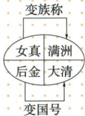

## 错法

努尔哈赤建金便称他1636建清，或满洲与大清互作族名国号。错在把先后人物和两个名称对象删除，图上两行被误串成同一条。

## 正解

1616努尔哈赤后金、1635皇太极满洲族称、1636皇太极大清国号、1644入关逐项配。原皇太极图女真至满洲与后金至大清并列，不是满洲先为国号后来再变大清族称。

## 例题

**原资料（M17-S06、S09，非独立题）：**明后期东北女真发展；1616努尔哈赤基本统一女真各部，建大金，史称后金；死后皇太极继位，1635定族称满洲，1636改国号大清。原图上行女真→满洲为变族称，下行后金→大清为变国号。

**原手写辨析恢复：**明朝由李自成农民起义推翻，不是由清军推翻；清朝开国皇帝皇太极，不是努尔哈赤。

**分析补写：**族称指人群称谓，国号指政权名称，皇太极做了两个不同动作，不能将满洲当国号或大清当族名。后金是在女真统一过程中形成的政权，后字为后人区别历史同称，不能与1115阿骨打建金混为一国。1644是后续入关和入北京，不是大清国号直到此时才第一次出现。原图并列两变化，不采用自动识别互接的长链。

### 来源定位

- M17-S06：full.md（历史扫描分册101-150），L702–L712，后金1616族称1635国号1636及原手写辨析；6484926a-d709-4079-96ba-4a8c4b0a1b00_origin.pdf，实际PDF第11页。
- M17-S09：full.md（历史扫描分册101-150），L722–L745，四年四动作原表与皇太极双变化原图；6484926a-d709-4079-96ba-4a8c4b0a1b00_origin.pdf，实际PDF第11页。
