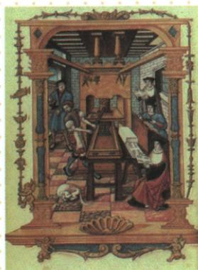

## 错法

见工场规模或资本主义萌芽，便改为清朝机器工厂已普遍、全国已经资本主义社会。容易错在把组织关系、生产工具与社会阶段当成同一个指标，又删原学者和近似早期限定。

## 正解

先按机户资金与织工劳动解释雇佣关系，保留手工生产条件。原有些工场规模较大只说明局部规模，原学者早期形态说明解释口径；机器技术和全国制度均需额外证据，本题没有。原手写工场非工厂就是针对工具阶段的提醒。

## 例题

**原题（M20-S05）：**清朝手工工场的特点、实质。

**原答案完整保留：**特点：“机户出资，织工出力”。实质：机户是早期的资本家，织工是早期的雇佣工人。有学者认为，这种生产方式近似于西方资本主义生产关系的早期形态，称之为“资本主义萌芽”。

**完整解析补写：**出资表示由机户组织生产所需资金，出力表示织工以劳动参与生产。两者分工指向雇佣生产关系，不能仅凭产品好、工场大就判断实质，因为规模与质量不直接说明劳动者和出资者的关系。原答把机户、织工分别对应早期资本家、雇佣工人；对资本主义萌芽保留“有学者认为”“近似”“早期形态”三个限定，不改成全国已经进入资本主义社会。

**原正文（M20-S02，非独立题）：**清有比较成熟的手工工场，有些颇具规模，原页手写特意提醒不是“工厂”。明松江棉纺织、苏州丝织、景德镇制瓷中心；清丝棉印染制瓷品种繁多产品精良。中心、产品、组织是三组证据，手工工场不能据名称断定已使用近代机器大工业。

### 西欧分散到集中工场的组织机制与原印刷问及五特点

**原图问：指出与上图有关的手工业方面新的生产组织形式。**

**原答：手工工场。完整解析。**原图注确定印刷工场，画面可见多人在同一生产场景分工，结合商人供原料工具、组织雇工的原文，识手工工场。这不是自动识别所猜的古人读书书房；不能从图中有器械便直接当19世纪机器大工厂，手工工具和机械化动力不是同一判断。也不能靠画面小人数量统计实际雇工总人数或全行业劳力。

**原发展完整材料。**13世纪分工细化、小作坊发展，农民为缴封建税在家用工具从事手工，出现分散工场。后来商人除原料还给统一工具，工人完全出卖劳力，与雇主彻底雇佣；统一工具配备常使同地点集中劳动，形成集中工场；雇工分工合作提高劳动生产率。

**机制。**原料联系将商人和生产者联系，统一工具与组织使劳动者主要以劳力参与，生产条件由雇主安排，解释雇佣加深。工序分工让各人更熟悉所做环节、减少反复转换，合作把各环节接为持续生产，因此效率提高，不只说集中所以高效。分散也是经营组织形式，不必每人先住同一建筑才有生产联系；集中主要指地点与协作，并未自动提供蒸汽机器证据。雇佣形成是关系变化，工具先进程度另判；原“常常”“逐渐”不写成所有场地同时集中。

**原重难材料问：根据材料结合所学，总结新手工经营特点。**材料给商人原料、统一工具、工人出卖劳动、同地集中、分工合作提高效率，原引教科书。

**完整原五答。**由分散走集中；参与阶层多如农民手工业者商人；适应市场需求；有资本主义生产关系特征；效率高。

**逐项依据。**集中由统一工具组织与同地劳动支撑；多阶层由前文农民家中生产、商人组织、手工劳动者参与支撑，不能说仅这段字面已列全部阶层；市场需求接商人组织售卖和同课新经营背景；关系特征由劳动者与雇主的彻底雇佣支撑；效率由分工合作支撑。每个结论使用对应材料或原问允许结合所学，不能只抄效率便漏其余四项。

### 来源定位

- M20-S02：full.md（历史扫描分册101-150），L1036–L1038，手工业中心手工工场及商业网络银流商帮完整表；6484926a-d709-4079-96ba-4a8c4b0a1b00_origin.pdf，实际PDF第17页。
- M20-S05：full.md（历史扫描分册101-150），L1048–L1051，手工工场特点实质两问原答与学者限定；6484926a-d709-4079-96ba-4a8c4b0a1b00_origin.pdf，实际PDF第17页。
- WN13-Q01：full.md（历史扫描分册251-300），L1502–L1516，中世纪印刷工场原图组织形式原问原答；5dc2c8da-0729-4435-bf9a-d7b79d1838b6_origin.pdf，实际PDF第22页。
- WN13-Q03：full.md（历史扫描分册251-300），L1617–L1631，新手工经营方式原材料原问五点完整原答；5dc2c8da-0729-4435-bf9a-d7b79d1838b6_origin.pdf，实际PDF第23–24页。
- WN13-S04：full.md（历史扫描分册251-300），L1554–L1564，分散集中工场发展过程效率与整体面貌变化；5dc2c8da-0729-4435-bf9a-d7b79d1838b6_origin.pdf，实际PDF第23页。
- WN13-S07：full.md（历史扫描分册251-300），L1580–L1601，手工原图商人工人原料工具地点与雇佣本质易混；5dc2c8da-0729-4435-bf9a-d7b79d1838b6_origin.pdf，实际PDF第23页。
