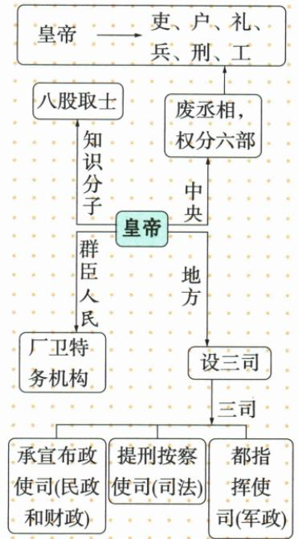

## 讲解

### 是什么

明太祖废除丞相，提升六部职权，使六部直接向皇帝负责。六部为吏户礼兵刑工，分管不同事务；这里变化在领导关系与相权，六部名称的存在不等六部由明首次创立。

### 怎么来的

丞相可统领多方面行政，废相撤掉能在皇帝与各部之间统合事务的强权位置；权分各部让臣下彼此难集成全套资源，各部直接负责又将协调决断集中到皇帝。臣下分权与皇帝集权看的是不同对象，所以不是矛盾。皇帝工作和决策负担也更集中，结构有稳定控制的一面及纠错风险。

### 什么时候能用

辨中央相权与君权关系可用；六部不是六个宰相，也不独立于皇帝。原表主要结构概括不代表所有基层事事由皇帝亲手处理；与唐三省、元中书六部比较要核朝代隶属。

## 例题

**原常考设问（M15-S05）：**朱元璋改革官制的特点。

**原答案完整保留：**地方和中央的各个部门，既互不统属，又互相牵制，各自直接向皇帝负责。

**原措施表完整保留（M15-S03）：**目的为巩固统治。中央废丞相，提升吏户礼兵刑工六部职权，使六部直接向皇帝负责；把大都督府分中左右前后五军都督府，将军队调动和武官任命的权力统归兵部。地方将行中书省权一分为三，设三司互不统属；分封诸子为王驻守监控地方。明太祖设皇帝直接指挥的锦衣卫，掌侍卫侦察缉捕刑狱；明成祖设东厂，明宪宗设西厂，合称厂卫。影响为各部门相制、皇权高度集中、君主专制加强。

**完整解析补写：**中央撤掉原丞相统领环节，六部各自负责，地方把原行省集中的权拆为民政财政、司法、军政三类，多个部门较难形成独立整套权力。分权对象是臣下和地方，集中对象是皇帝，两动作服务同一控制目标，并不矛盾。兵部调动任命与五府分掌的安排使军权难由一府独揽，最终仍受皇帝控制，不能把兵部读成独立于皇帝。厂卫越过一般臣下直接为皇帝侦察控制。

**图示核验与边界：**原图是围绕皇帝的多组关系，八股到知识分子、厂卫到群臣人民，中央六部与地方三司分别示官制。图中的三司为承宣布政使司民政财政、提刑按察使司司法、都指挥使司军政；不是宋的度支盐铁户部。原表各部门直接负责为主要结构概括，不当每名基层官员事事都直接向皇帝个人报告的全层级制度详表。

**原评价表（M15-S11，非独立题）：**进步性：加强专制主义中央集权统治、稳定和重建社会秩序、恢复和发展社会经济、巩固和发展统一多民族国家。消极性：给明统治埋危机；以强化君主专制为核心，最大限度置统治于皇帝一人之手，杜绝排斥其他人的干预，从根本上埋更大统治危机。

**分析补写：**控制地方和臣下有利统一组织，但决定高度依赖一人，纠错与制约不足可能使个人失误扩大。两面分别看早期秩序作用和权力结构风险，不由加强皇权直接推每年经济增长，也不以风险断从未有恢复。原杜绝排斥是突出专制取向的概括，不否认实际仍有大臣参与行政；原表未给政策效果数值，不自编统计例。

## 易错

- 废丞相是分权给民众。
- 六部首次出现于明。
- 多部门便皇权必减弱：忽略谁最终掌权。

### 来源定位

- M15-S03：full.md（历史扫描分册101-150），L483–L485，中央地方改革军权厂卫目的影响完整原表；6484926a-d709-4079-96ba-4a8c4b0a1b00_origin.pdf，实际PDF第7页。
- M15-S05：full.md（历史扫描分册101-150），L501–L503，朱元璋改革官制特点原问原答；6484926a-d709-4079-96ba-4a8c4b0a1b00_origin.pdf，实际PDF第7页。
- M15-S07：full.md（历史扫描分册101-150），L517–L540，皇权图六部三司思想和厂卫不同对象；6484926a-d709-4079-96ba-4a8c4b0a1b00_origin.pdf，实际PDF第8页。
- M15-S11：full.md（历史扫描分册101-150），L578–L580，明加强君主专制进步和统治危机完整评价表；6484926a-d709-4079-96ba-4a8c4b0a1b00_origin.pdf，实际PDF第8页。
