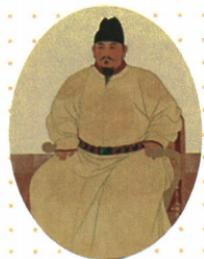

## 讲解

### 是什么

明朝是朱元璋在1368年建立的王朝，初都应天府即今南京，朱元璋为明太祖。建立政权与攻取元大都是两件事，原资料顺序为先建立、后攻占，不能以同年相合就合为一个地点动作。

### 怎么来的

元末官吏搜刮使群众难维持生活，社会矛盾激化、起义队伍出现，朱元璋队伍在反元过程中扩大，是建明的政治军事条件。建立新朝宣布新的统治组织；随后攻旧政权都城使元在该中心的统治结束。背景危机解释反抗与机会，队伍壮大解释建政权能力，不能只列1351、1368而省因果。

### 什么时候能用

用来配人物、时间、开国都城及事件先后。结束元朝统治按原书中原王朝格局理解，不自动证明全部蒙古政治力量同一天消失；画像辅助身份，不据衣帽推具体年份。迁都北京是后来的另一阶段。

## 例题

**原題（M15-S04）：**上图是明朝的开国皇帝，他是谁？他于哪一年在什么地方建立明朝？

**原答案完整保留：**朱元璋，1368年，应天府。

**完整解析补写：**题注明太祖与本课开国史实配朱元璋；1368为建明年，不取1351反元起义年；应天府今南京为首都，不以明成祖后来迁北京倒写开国都城。原辨析特别说明明建立后才攻占元大都，建新朝与攻旧都为同年先后两个动作，不能把大都当朱元璋称帝所在地。像仅作身份题辅助，服饰不独证建朝年月。

**原资料背景与过程（M15-S01）：**元末政治腐败、搜刮民财导致动荡，1351农民起义，朱元璋队伍逐步强大；1368朱元璋建立明、定都应天，随后明军攻元大都，结束元朝统治。

## 易错

- 朱棣是开国皇帝：混迁都者与建立者。
- 1368都北京：把后期都城倒投。
- 先攻大都才在大都称帝：违原顺序与地点。

### 来源定位

- M15-S01：full.md（历史扫描分册101-150），L469–L480，元末危机1351反元与1368应天建明、先建立后攻大都；6484926a-d709-4079-96ba-4a8c4b0a1b00_origin.pdf，实际PDF第7页。
- M15-S04：full.md（历史扫描分册101-150），L487–L499，明太祖像身份年份都城三任务原问原答；6484926a-d709-4079-96ba-4a8c4b0a1b00_origin.pdf，实际PDF第7页。
