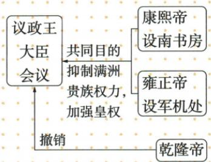

## 讲解

### 是什么

清初议政王大臣会议有满洲贵族集体权力；康熙设南书房抑贵族，雍正军机成为亲近皇帝中枢，乾隆撤名存实亡的旧会议。几个机构和动作构成皇帝减少贵族制约的过程，非同帝一次创建。

### 怎么来的

贵族会议共同讨论能制约皇帝决定，皇帝用亲近机构另建办理渠道，将信息与拟办程序向自己集中，使旧会议实际影响下降，再撤旧制度。设新机构与废旧机构服务同一方向却分阶段；图共同目的应归新控制措施，不归议政会议自我削权。原表早期皇帝不能改是突出制约，不当全史每件事不可变的逐案证明。

### 什么时候能用

读朝代人物机构及君权变化可用。南书房、军机、议政会并非完全同一种职责；原本课没有所有早期权力变动细节，图箭头不替实际制度完整年表。

## 例题

**原资料（M19-S03、S04，非独立题）：**清初保留满洲贵族组成议政王大臣会议，军国大事经其讨论、原表说连皇帝不能改变决定；康熙设南书房抑满洲贵族权。雍正临时军机房处理西北军务，不久军机处常设、皇帝选亲信；议政会议名存实亡，乾隆撤销。

**分析补写：**早期贵族议政有强影响，皇帝以较贴近自己的机构削弱贵族集体制约；南书房与军机分别由康熙、雍正设置，撤旧会议又是乾隆阶段。原图共同目的指抑贵族、强皇权，不当议政会议自身设立就为削自己。原表皇帝不能改为教学突出贵族制约的概括，不能以一段断全时期任何具体决策永远不可变；本课没有逐案档案，不自编会议例。

## 易错

- 康熙设军机雍正设南书房互换。
- 议政会议也为削自己权。
- 乾隆撤销军机而非旧会议。

### 来源定位

- M19-S01：full.md（历史扫描分册101-150），L918–L933，君权图抑贵族目标南书房军机处与乾隆撤会议；6484926a-d709-4079-96ba-4a8c4b0a1b00_origin.pdf，实际PDF第14页。
- M19-S03：full.md（历史扫描分册101-150），L943–L947，议政贵族会议与康熙南书房原表；6484926a-d709-4079-96ba-4a8c4b0a1b00_origin.pdf，实际PDF第14页。
- M19-S04：full.md（历史扫描分册101-150），L949–L959，雍正军机临时常设性质职责与议政乾隆撤销；6484926a-d709-4079-96ba-4a8c4b0a1b00_origin.pdf，实际PDF第14页。
