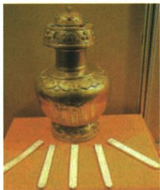

## 讲解

### 是什么

原书记顺治1653正式赐五世达赖封号，1713清封班禅额尔德尼，此后相关继承须中央册封。册封为政治认可和制度联系，不等这些称谓直到清册封时才在世上首次出现。

### 怎么来的

藏传佛教领袖在当地有宗教社会影响，中央通过正式册封建立认可关系，将领袖继承与中央政治联系接起。它与常设官员监督、章程管理配合，形成多种治理渠道，不能只因宗教称号便与地方全部行政权完全等同，也不认为册封一个动作已替代全部事务管理。

### 什么时候能用

辨西藏治理方式及时间对象可用。原历代须册封是制度规则，具体每次办理的材料另核，不当本课已逐次检查全部案例。册封不等首次创造全部宗教名称，顺治与后续清廷动作分时段。

## 例题

**原题（M18-S03）：**金瓶掣签制度反映了清政府对哪一地区的管辖？除此之外，清政府还采取哪些措施加强对这一地区的管理？

**原答案完整保留：**西藏。设置驻藏办事大臣。

**完整解析补写：**据题注金瓶掣签及本课制度对象定位西藏，不由瓶子的外形猜地区；第二任务问除此之外，故不能再次只写金瓶，原答列驻藏办事大臣。1727监督地方政务是另一项管理措施，解释有常设人员监督的联系。原书此题只给一项答案，其余册封噶厦章程在知识讲解分列，不伪称它们全是本题原答。图是制度物品展示，不是实际转世认定全过程的现场照片，也不是自动识别所称香炉。

**原西藏措施（M18-S06、S07）：**1653顺治赐五世达赖封号，1713清封班禅额尔德尼，此后历代达赖班禅须中央册封；1727驻藏办事大臣监督政务；1751设噶厦，授达赖与驻藏大臣管理政教；1793颁29条规范行政法规，驻藏大臣政治地位与达赖班禅平等，共同管政教，另掌军事对外；大活佛转世需金瓶掣签。各条为本书制度规则概览，不将应行规则当已经查验每一次实际办理均同样的统计。

## 易错

- 清册封等首次发明全部称号：动作对象扩大。
- 1653与1713互换。
- 宗教首领等所有行政官署的同义。

### 来源定位

- M18-S03：full.md（历史扫描分册101-150），L790–L804，金瓶掣签原图西藏及另措施两任务原問原答；6484926a-d709-4079-96ba-4a8c4b0a1b00_origin.pdf，实际PDF第12页。
- M18-S06：full.md（历史扫描分册101-150），L816–L828，1653达赖1713班禅册封、1727大臣1751噶厦；6484926a-d709-4079-96ba-4a8c4b0a1b00_origin.pdf，实际PDF第12页。
- M18-S07：full.md（历史扫描分册101-150），L830–L842，1793藏内善后章程29条职责与金瓶跨页续表；6484926a-d709-4079-96ba-4a8c4b0a1b00_origin.pdf，实际PDF第12–13页。
