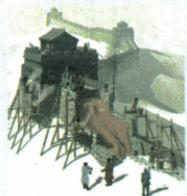

## 讲解

### 判据

同一材料题跨北方防务、东南抗倭、清西北平叛与共同目标，先拆任务及时间地区。图与设问认措施，原文字概括策略，史实须同时满足时地，认识再从证据接治理稳定发展。

### 流程

1. （1）分三任务：图与北方明情境识长城；意义由建设共同劳动防卫的历史记忆接原凝聚精神；换东南沿海再答戚继光抗倭。
2. （2）读不同风俗和水平对应因地制宜因俗而治，特殊方式服务总体治理，非退出管理。
3. 举史实同时核清前中期西北，可从准噶尔、大小和卓平叛原两备选取一；不同皇帝阶段不压到一天。
4. （3）认识先从措施归治理与发展，从平叛抗扰归稳定统一，回扣原共同体要求。
5. 核每句答到题：措施、意义、东南举措、策略、西北史实、综合认识六任务不能用一句民族团结全代。图仅情境示意不供高度关名，开放认识须有历史依据。

## 例题

**新考法原题（MQ-U6；原书标注2024湖南长沙中考改编，未另核真题身份）：**阅读材料，完成下列要求。

**原材料完整保留：**在理解边疆与“大一统”关系时，应处理好几种关系：如特殊与一般的关系，根据不同风俗和社会发展水平，采取特殊的、过渡性的管理方式，加强行政管控，使其逐渐融入“大一统”的治理体系之中；又如动荡与稳定的关系，在具体政治行为中，治国者选派得力可靠的能臣来治边护边，采取积极有效的措施，加强行政管控，确保边疆稳定和天下太平。——摘编自李大龙等《中国边疆史地研究》。

**原问（1）：**观察下图，指出明朝为防御北方蒙古族南扰而采取的措施，并分析该措施在中华民族发展史上的深远意义。当东南沿海面临外来侵扰时，明政府又采取了哪一举措？

**原问（2）：**根据材料，概括治国者在边疆治理上处理“特殊与一般的关系”时采取的策略。例举清朝前中期巩固西北边疆的一项史实。

**原问（3）：**综上，从边疆治理和国家统一的角度，谈谈你对铸牢中华民族共同体意识的认识。

**原答案完整保留：**（1）措施：修筑长城。意义：增进中华民族凝聚力；长城体现中华民族勤劳、勇敢、团结的民族精神，被视为中华民族精神象征。举措：戚继光抗倭。（2）策略：因地制宜、因俗而治。史实：平定准噶尔部，平定大、小和卓叛乱。（3）认识：加强边疆治理、促进边疆发展；打击分裂势力和外来侵略，坚决维护国家统一，铸牢中华民族共同体意识；等等。

**完整推理补写：**

（1）图为墙体守卫和防御情境的绘制图，结合明北方蒙古南扰题干辨长城，不能凭图猜具体关名或实测高度。问意义已超单一防务功能，要用工程组织建设、共同劳动防守的历史记忆接凝聚与民族精神，再按原答保留象征评价；图一张不证明所有人想法完全相同。东南沿海另题换地区敌情，按本课倭寇侵扰与戚率军平倭答戚继光抗倭，不把北方长城当东南抗倭具体举措。

（2）材料不同风俗、社会水平→管理方式有差别，概括因俗因地制宜；这些特殊安排与逐渐纳整体治理的共同目标相连，不是特殊便放弃行政管理。下一任务同时限清、前中期、西北，可选平定准噶尔或大小和卓叛乱；原答列两项供选择，问一项不要求必两项。明奴儿干、清台湾府、雅克萨抗俄分别错时期或地区，不能只说都是边疆便顶替西北。应依已有条目康熙噶尔丹阶段与乾隆最终平叛分清，不编单一年完成两场。

（3）综合题先按原材料和前问提治理、发展、稳定三关系，再接打击分裂与外来侵扰、维护统一的认识。策略体现具体条件，行政防务生产等支持稳定；不同方式可有同一巩固目标。认识不是再抄长城年代或仅喊口号，每句要回扣所学事例；等等为开放表述不等任何无关句都算原答。

## 易错

一项史实不必抄两个才算；雅克萨在东北不能顶西北；因俗管理不等不管；意义不止军事功能，综合认识也不只堆年代口号。

### 来源定位

- MQ-U6：full.md（历史扫描分册101-150），L1300–L1324，边疆与大一统材料原图三小问六任务完整原答；6484926a-d709-4079-96ba-4a8c4b0a1b00_origin.pdf，实际PDF第21页。
