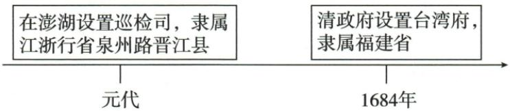

## 讲解

### 判据

三个年份接近但分别回答殖民统治终结、归清版图、常设行政建立；先定动词对象与行动者。清时期可发生郑氏行动，不因此说郑服从清政府。

### 流程

1. 1662郑收复，荷兰殖民者投降。
2. 原辨析未归清，1683郑氏败后纳清版图。
3. 1684清设府隶福建，行政组织与军事纳入不同。
4. 解释设府治理和海防持续联系，不反改1662为清收复。
5. 跨朝表清行按时代概览处理，最早机构问元澎湖，府为后来的具体建制。

### 方法依据与边界

收复指终结荷兰殖民占领，纳入清版图指清与郑氏控制关系变化，设府指制度化日常行政，两层军事转变与一层建制不能压成同年。郑成功的行动虽处清时期，其政治立场并非替清政府执行；原跨朝表按时代归类时需保留这点。元澎湖机构到清府可概括地区管理延续，但地点范围和具体职责仍不同，时间轴不补每年连续同等管辖的档案。先辨动词对象，再问行动主体，比只记1662、1683、1684更能迁移。

## 例题

**原易混辨析（M18-S02）：**郑成功收复台湾后没有归附当时清政府，1683台湾才归清版图。

**原建制表（M18-S05，非独立题）：**1683清军两万人进攻台湾，郑氏军败，台湾归清；1684清设台湾府隶福建。设府加强中央管辖、巩固东南海防、社会经济进入新时期。

**分析补写：**收复反映驱逐荷兰殖民统治，纳入清是后来的政权归属，设府又是常设行政组织，三年三动作不同。设府组织事务、保持中央地方联系，海防与发展作用由持续治理支持，不能只因一个府名自动证明各项立即达到最好。跨朝表将郑成功放清朝行，按清存在时期概览保留，但行动主体非清政府，不能用行标题否定原易错辨析。

**原史料（M18-S01）：**然台湾者，中国之土地也，久为贵国所踞，今余既来索，则地当归我，珍瑶不急之物，悉听而归。——连横《台湾通史》。

**原解读完整保留：**史料摘自民族英雄郑成功收复台湾时给殖民者的一封劝降信。它反映了台湾自古以来就是中国的领土，也表明了郑成功收复台湾的决心。

**原题1（原书标注[2023辽宁]，未另核真题身份）：**史料中的“余”指的是谁？体现了什么事迹？

**原答案：**郑成功。郑成功收复台湾。

**原题2（原书标注[2024黑龙江]，未另核真题身份）：**请用一句话评价郑成功。我国历史上中央政府首次在台湾地区正式建立的行政机构是什么？

**原答案完整保留：**郑成功是我国历史上的民族英雄。元朝时在澎湖设巡检司。

**完整解析补写：**余为自称，按题出处和劝降背景配郑成功，不配连横为收复行动者；来索与地当归我表收复决心，事迹为收复台湾。驱逐殖民占领、维护领土人民利益支持民族英雄评价，不只用作战胜利来定义。首次机构任务要核台湾地区和正式行政两个限定，元澎湖巡检司符合原书口径，不能因本课讲清便改1684台湾府首次，也不能改成澎湖机构已在台湾本岛同址设府。研究最早记载需另核原卷出处，不编卷页。

**原过程（M18-S04）：**1661从金门进台湾，围赤崁城与台湾城；赤崁荷军先降，1662总攻荷殖民者投降，占据38年的台湾回到祖国怀抱。序号①②不并入年份。

### 明清单元原题2：台湾行政阶段共同主题

**单元原题2（MQ-U2；原书标注2023北京中考，未另核真题身份）：**对以下示意图理解正确的是（）。

**原图文字：**元代在澎湖设置巡检司，隶属江浙行省泉州路晋江县；1684年清政府设置台湾府，隶属福建省。

A.郑成功从荷兰殖民者手中收复台湾

B.清政府推行垦荒政策，开发西南地区

C.清政府设置伊犁将军，巩固西北边疆

D.中央政府不断加强对台湾的有效管辖

**原答案：D。原解题思路完整保留：**材料反映元、清对台湾地区管辖，元设置澎湖巡检司管理台湾，这是中央政府管理台湾最早行政机构；此后清设台湾府，说明不断加强有效管辖。

**逐项解析补写：**A史实在本课成立但不合此图，图列设行政机构，未列1662郑的收复行动，不能以同与台湾有关替换图的共同主题。B不合，西南垦荒不在图。C不合，伊犁将军西北对象不同台湾。D正确，两个阶段行政机构和隶属信息支持台湾地区行政联系与管辖发展主题。

**定位边界：**原详解管理台湾是台湾地区教学概括，图明确澎湖设机构，不能改成元已在台湾本岛同址设台湾府；首次行政机构也不等此前无人到台湾。1684设府不同1683纳入清版图与1662收复，不把三阶段压到同一年。时间轴方向仅示前后，不为连续每年具体管辖状况提供档案。

## 易错

- 收复等全清版图即刻形成。
- 一个时期内行动者都同一政府。
- 后建府便否认早元行政联系。

### 来源定位

- M18-S01：full.md（历史扫描分册101-150），L771–L784，郑成功劝降史料解读身份事迹评价首次机构四原任务；6484926a-d709-4079-96ba-4a8c4b0a1b00_origin.pdf，实际PDF第12页。
- M18-S02：full.md（历史扫描分册101-150），L786–L788，郑收台湾不归清1683才纳清版图原辨析；6484926a-d709-4079-96ba-4a8c4b0a1b00_origin.pdf，实际PDF第12页。
- M18-S05：full.md（历史扫描分册101-150），L812–L814，1683纳入1684台湾府福建及治理海防意义；6484926a-d709-4079-96ba-4a8c4b0a1b00_origin.pdf，实际PDF第12页。
- M18-S15：full.md（历史扫描分册101-150），L905–L907，西藏新疆台湾东北跨朝治理重难完整表；6484926a-d709-4079-96ba-4a8c4b0a1b00_origin.pdf，实际PDF第14页。
- MQ-U2：full.md（历史扫描分册101-150），L1205–L1254，元澎湖1684台湾府示意图四项及原详解；6484926a-d709-4079-96ba-4a8c4b0a1b00_origin.pdf，实际PDF第20页。
