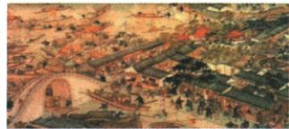

## 讲解

### 判据

绘画辨时代先用题注和文字背景，景象再用可辨活动。乾隆提供清朝时间，苏州提供地区；船只、街市与人群为城市活动证据，不能只有一张拥挤画面就推全国盛世或人口数。

### 流程

1. 读原题乾隆时苏州，不靠绘画颜色年代感猜朝代。
2. 乾隆对应清朝，先答朝代这一问。
3. 看城市建筑、船只和人群往来，结合题目繁华描述，接城市繁荣、商业发展。
4. 完整保留原答人民安居乐业，但说明这是画面表现和原题评价，不能逐人检验生活收入。
5. 答案范围留在此清代城市场景，不拿人数、船数算全国人口或贸易额。题注确定时间地点，场景支撑活动概括，二类证据各司其职。

## 例题

**原题（M20-S06）：**画面描绘了乾隆时苏州繁华的景象。此图反映了哪一朝代的什么气象？

**原答案完整保留：**清朝。人民安居乐业，城市繁荣，商业发展。

**完整解析补写：**“乾隆”先定位清朝，“苏州”定位描绘城市。图中建筑街市、船只及人群活动，与城市交通交换场景相合，结合原题明确的繁华描绘，概括城市繁荣、商业发展，并保留原答安居乐业。此处绘画是作者表现城市景象的材料，不能逐人断其收入、用画中人数作全国人口统计，或证明所有地区都没有贫困。画面小而拥挤时以原题注和可辨活动共同判断，不凭色调或机器英文描述断朝代。

## 易错

画乾隆不归明朝；商贸场景不等全国无贫；英文机器描述无文字不能替代原中文题注，图中人数也不是人口统计。

### 来源定位

- M20-S06：full.md（历史扫描分册101-150），L1053–L1067，姑苏繁华图局部原图题注朝代气象原题原答；6484926a-d709-4079-96ba-4a8c4b0a1b00_origin.pdf，实际PDF第17页。
- M20-S07：full.md（历史扫描分册101-150），L1069–L1071，城市与汉口佛山专业市场跨页链接；6484926a-d709-4079-96ba-4a8c4b0a1b00_origin.pdf，实际PDF第17–18页。
