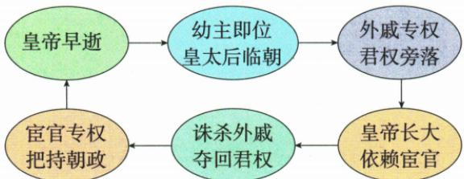

## 错法

把原图每个箭头都读成无例外必然关系，认定东汉每位皇帝都幼年即位、依靠宦官、随后因宦官专权立即早逝。错在把形成重复局面的机制图当全部人物的逐年记录，并给闭环补了原文没有的死亡因果。

## 正解

原表说“大多”年幼，说明概括而非每个人都相同。依靠关系解释外戚、宦官如何交替把持朝政；闭环提示后来的幼主又可能重现条件，不能证明所有皇帝同一经历和死因。需要精确个人史时应另外查材料，本图只承担机制和影响解释。

## 例题

**原资料形成过程（H13-S07，非独立题）：**皇帝早逝 → 幼主即位、皇太后临朝 → 外戚专权、君权旁落 → 皇帝长大、依赖宦官 → 诛杀外戚、夺回君权 → 宦官专权、把持朝政；图再连回皇帝早逝。

**逐环解析补写：**幼帝不能自行处理朝政，皇太后临朝使外戚获得介入机会；成年皇帝希望摆脱外戚，借宫内宦官帮助；宦官因参与斗争获得权势，又可能把持朝政。图是重复出现局面的机制概览，不是每位皇帝经历和死因完全一致的精确年表，末尾连线也不能解释成宦官专权必然使皇帝立即早逝。原箭头方向逐个核对，不改成外戚和宦官从始至终同一集团。

### 来源定位

- H13-S07：full.md（历史扫描分册51-100），L361–L365，外戚宦官专权原因、循环原图与影响原表；a8d85606-ccac-4ba9-89c2-44c981a45642_origin.pdf，实际PDF第6页。
