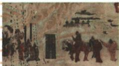

## 讲解

### 是什么

张骞在汉武帝时期两次出使西域：第一次前138年，自长安出发，目的为联络大月氏夹击匈奴；第二次前119年，率300多人的使团，带牛羊、金币、丝绸等财物，深化友好交往。首次多次被扣留又逃脱，大月氏不愿参战，初始军事目的未达到，但汉朝了解到西域情况。

### 怎么来的

匈奴军事压力使汉朝希望联合力量，决定第一次出使目的。过程困难并不抹去获取地理、政权和交往信息的作用；目的与实际效果可以不同。第二次从军事联络进一步转向友好往来，携财物使团访问各地，促进了解和联系，为使者商人后来往来创造基础。

“凿空”强调开通有组织交流的贡献，不意味着张骞一人亲自建立后来全欧亚所有道路。他为丝路奠基，持续交往由多方人员共同发展。原长题还把政治经营、贸易文化和友好关系作为后续影响，须区分本人出使行动与后来制度成果；前60年西域设府并非张骞亲手当时完成。人物精神从坚持使命的过程归纳，唐壁画与后世邮票则反映纪念，不作为汉代现场照片。

### 什么时候能用

用于两次出使时间、目的、过程、意义和人物精神。第一次联大月氏，不以贸易为最初目的；第二次前119年与漠北战役同年但为不同事件。原书使团300多人只对应第二次，不移到所有旅队人数。

## 例题

**原资料史料与两问（H14-S04）：**

然张骞凿空，其后使往者皆称博望侯，以为质于外国，外国由此信之。——《史记·大宛列传》

原解读：“凿空”的意思是开通道路。张骞第一次开辟出中原通往西域的道路，中原王朝第一次和西域有了友好往来，所以说他出使西域是凿空之举。

1. 出题角度：[2023 辽宁]史料中的“张骞凿空”指哪一历史事件？**原答案：张骞通西域。**
2. 出题角度：[2022 湖南]在“凿空”西域基础上拓展的沟通古代东西方往来的大动脉叫什么？**原答案：丝绸之路。**

**完整解析与范围补写：**第一问的对象是出使事件，第二问的对象是后来交通与往来网络，事件与道路不能互换。原书“第一次”放在中原王朝经营、较广范围有组织交往的叙述中理解，不能扩成此前欧亚各地从无任何物品、人员或邻近地区交流；国博[秦汉交流说明](https://www.chnmuseum.cn/Portals/0/web/zt/20170916qhwm/mobile/index.html)也区分此前邻近地区自然传播与王朝经营下的交流。考试标签按原书保留，未独立核实真题身份。

**原资料设问（H14-S02）：**通过壁画和邮票，我们能得到什么启示？

**原答案：**张骞忠诚爱国、勇于开拓进取、不畏艰险、百折不挠的精神值得我们学习。

**完整解析补写：**壁画和邮票表现后人对张骞的纪念，精神依据还需结合其多次被扣留、逃脱后继续使命的出使过程；不能只凭人物站姿得出全部品格。壁画原题明确唐朝，邮票为后世纪念载体，均不是张骞出使现场记录。照片中的邮票面值也不用于计算汉代贸易价格。

**原资料多角度影响题（H14-S09）：**

材料 命名为“丝绸之路”，其实是张骞通西域起到的效果。张骞通西域本身是出于军事、政治目的，而不是出于贸易。虽然张骞出使西域的最初目的没有达到，但他的出使扩大了中国丝绸在中亚的影响，引起了更远地方人们的兴趣。

——摘编自葛剑雄《历史上中国没有动力进行丝绸贸易》

结合材料，从多个角度谈谈张骞通西域的影响。

**原答案（三点完整保留）：**

1. 政治：增强了汉朝对西域地区的政治影响力，有助于维护封建国家的统一和稳定。西汉王朝得以加强对西域的经营，于公元前60年设置西域都护府，对西域地区进行有效的管辖。  
2. 经济、文化：张骞通西域后，汉朝和西域的使者、商人相互往来，促进了东西方的经济文化的交流发展，为丝绸之路的开辟奠定基础。  
3.民族关系：增进了汉朝和西域的友好关系。

**完整解析补写：**先辨出使最初军事政治目的与后续影响。联络大月氏的初始目的未达到，但了解西域、建立使者商人往来仍产生结果；后来政治经营、经济文化与友好关系属不同角度。前60年设府是后续西汉经营成果，不能说张骞本人在出使当天设府。答多个角度时每项写事实及作用，不仅列“政治、经济、文化”三个空标题。

## 易错

- 初始目的失败就说出使毫无意义：信息与交流效果仍存在。
- 出使等同本人开府：不同人物时期与行动。
- 用唐壁画证明汉代现场服饰精确无误：载体年代不一致。

### 来源定位

- H14-S01：full.md（历史扫描分册51-100），L401–L413，西域定义、两次张骞出使原比较表、广狭义辨析；a8d85606-ccac-4ba9-89c2-44c981a45642_origin.pdf，实际PDF第7页。
- H14-S02：full.md（历史扫描分册51-100），L423–L443，张骞壁画与邮票、精神启示原问原答；a8d85606-ccac-4ba9-89c2-44c981a45642_origin.pdf，实际PDF第8页。
- H14-S04：full.md（历史扫描分册51-100），L449–L463，史记凿空史料、原解读、两角度原设问原答；a8d85606-ccac-4ba9-89c2-44c981a45642_origin.pdf，实际PDF第8页。
- H14-S09：full.md（历史扫描分册51-100），L515–L527，葛剑雄摘编材料、多角度影响原题与完整三点原答；a8d85606-ccac-4ba9-89c2-44c981a45642_origin.pdf，实际PDF第9页。
