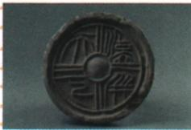

## 讲解

### 是什么

秦亡后项羽分封诸侯，自封西楚霸王，封刘邦为汉王；刘项为国家统治权展开楚汉之争。原表列项羽起初势强、刚愎自用、一味依赖武力，刘邦重民心、善用人才，力量由弱变强；垓下决战楚军败，刘邦获胜。前202年刘邦建立汉朝，后定都长安，史称西汉，刘邦即汉高祖。

### 怎么来的

秦的覆亡结束了秦统治，却没有自动确定一个新的统一政权由谁领导。项羽分封后，刘项争国家统治权，说明从反秦共同目标转为帝位竞争；这与秦亡前两人参与反秦的性质不同。力量大小还会受组织、人才、纪律和民众支持影响，不能只按战争初期兵力强弱预定结局。

刘邦胜利后建立汉朝，结束楚汉之争的结果与新王朝建立相接；但建立政权与恢复被战乱破坏的生产是不同任务。新政权需要面对民众困苦与社会凋敝，因而采取休养生息。纪年与都城也要按对象记：前207年秦亡、前202年西汉建立，咸阳是秦都、长安为西汉后来定都地，不能把相近年代和地名混成一条。

### 什么时候能用

用于判断楚汉之争目的、刘邦获胜原因及西汉建立的人物年代都城。原文说“后定都长安”，不改成建立当天已完成迁都。秦亡后的争帝位不归农民战争；原表没有完整逐战过程，不补造战役纪年、军队人数或具体策略细节。

## 例题

**原资料设问（H11-S04）：**刘邦战胜项羽的原因。

**原答案完整保留：**刘邦善于用人，能够人尽其才；性格百折不挠，能够依时而变；注重收揽人心，严明军队纪律，得到百姓的拥护；等等。

**完整解析补写：**善于用人使不同人才发挥作用，增强组织和应对能力；坚持并能随形势变化调整，帮助力量由弱转强；军纪和收揽民心使刘邦得到百姓支持。原表与项羽刚愎自用、一味依赖武力形成对照，因此不能用最初强弱判定最后一定胜负，也不能只写刘邦运气好。以上为资料给出的重要原因，不表示没有其他军事和政治条件，更不据此编造具体将领某次行动。

**原资料设问（H11-S06）：**观察图片，说说其蕴含的寓意。

**原答案：**“汉并天下”反映了西汉统一全国的寓意。

**完整解析补写：**依据原题所给文字“汉并天下”解读：“汉”指王朝，“并天下”表达统一。这里判据是铭文及图题，不是圆形外观；瓦当反映统一的表达，不能仅凭这一件器物复原所有战争、精确疆界和百姓态度。自动图像描述称“无文字”，与原图文字不符，不能据此删掉铭文。

## 易错

- 把巨鹿之战当楚汉最终决战：巨鹿属于项羽反秦，原表终局为垓下。
- 西汉建立写前207年：此为秦亡纪年。
- 初始势强就断言项羽必胜：忽略力量会随用人与支持变化。

### 来源定位

- H11-S01：full.md（历史扫描分册51-100），L127–L135，楚汉之争完整原表、西汉建立纪年都城与黄老思想注；a8d85606-ccac-4ba9-89c2-44c981a45642_origin.pdf，实际PDF第3页。
- H11-S04：full.md（历史扫描分册51-100），L161–L163，刘邦战胜项羽原因原设问与原答；a8d85606-ccac-4ba9-89c2-44c981a45642_origin.pdf，实际PDF第3页。
- H11-S06：full.md（历史扫描分册51-100），L175–L187，汉并天下瓦当图与寓意原设问；a8d85606-ccac-4ba9-89c2-44c981a45642_origin.pdf，实际PDF第3页。
