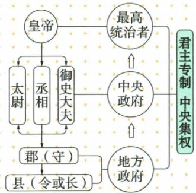

## 讲解

### 是什么

秦朝以皇帝为最高统治者，总揽政治、军事、财政大权，各级机构官员遵从皇帝指令。皇帝以下有丞相、太尉、御史大夫，原书称三公，分别掌行政、军事、监察；三公以下设置掌财政、宫廷等事务的九卿。君主专制讨论最高权力集中于皇帝，中央集权讨论地方权力受中央控制，是不同层面。

### 怎么来的

统一后管理范围扩大，需要使政令能够自最高统治者贯穿到全国；皇帝统合最高权力，中央官员分工处理事务，地方郡县落实管理，形成从中央到地方的组织体系。三公分工是分担管理事务，不表示三人拥有同皇帝平行的最终权力。监察与行政、军事职能不同，也不能把御史大夫解释成地方封国君主。

郡县长官由朝廷任免，使地方权力来源与中央联系，体现中央集权；官员遵从皇帝，体现最高权力所在。二者可共同存在，但不能见“皇帝”一词便认为已证明任何时代地方都毫无独立力量，也不能见有中央机构便推断皇帝如何行使所有具体权力。用结构图理解制度，需要看层级、职权与任免关系，而不是只数几个官名。

### 什么时候能用

材料给皇帝权威、中央职官或地方任免时，先分中央内部最高决策与中央—地方关系。原书列三公职掌用于初中制度概览，图不等于每位皇帝任职人员的完整名单；不补造九卿具体人名、设官日期或某次任命。结构的历史影响还须按资料范围，不改成现代分权制衡。

## 例题

**原资料说明材料（H9-S02、S05，未附独立设问）：**皇帝—丞相/太尉/御史大夫—郡（守）—县（令或长）；三公分别掌行政、军事、监察。

**图解补写：**图顶端皇帝为最高统治者，中央官员分担职能，郡县属于地方管理层级。君主专制与中央集权从不同关系读出，不把三条向下线当作三公各自拥有三个独立国家。原图是制度概览，不是现实机构运行每条具体命令的记录。

## 易错

- 将太尉写成监察官：三公职掌逐一对应，御史大夫掌监察。
- 将九卿说成九位地方诸侯：其为中央分掌事务官员。
- 以中央官员分工证明皇帝无权：分工与最高权力所在不同。

### 来源定位

- H9-S02：full.md（历史扫描分册1-50），L5189–L5212，中央政治建制原图；22fce0ae-e244-4784-abd1-7e1ac2556947_origin.pdf，实际PDF第50页。
- H9-S05：full.md（历史扫描分册1-50），L5290–L5306，皇帝、三公九卿、郡县的制度正文；22fce0ae-e244-4784-abd1-7e1ac2556947_origin.pdf，实际PDF第50页。
