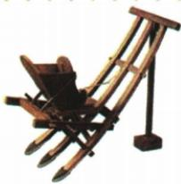
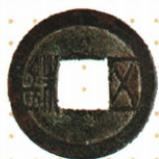
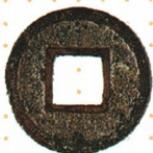

## 讲解

### 判据

题目用器物图，先看图题确定是什么，再结合用途和政策判断能研究什么。耧车模型与播种用途支持农业研究，五铢“颁行及使用”结合铸币权集中才支持中央集权；外观本身不够证明全国普及率或制度权力归属。

### 流程

1. 读图题与原物/模型标记。先确定耧车模型或五铢钱，不采用自动英文描述代替原图。
2. 提取可观察特征和题干补充信息。耧车用途来自本课说明，钱币名称来自题注；相似圆形方孔不能独自区分所有钱币。
3. 接入相关背景。播种工具对应农业技术，中央铸五铢对应铸币权和经济管理，避免看一张钱币图就直接跳中央集权。
4. 按问法回答研究领域或体现的制度作用，再说明中间依据。两问层次不同，不能一律只答经济。
5. 限定推论：单件器物不证明全国每人使用，模型不是古代原物，形制不证明发行主体；缺少政策条件时保留结论边界，不编数据。

## 例题

**原资料设问（H12-S01）：**观察图片，说说可以据此研究西汉哪一方面的状况。

**原答案：**耧车是西汉时期的新型播种工具，据此可研究西汉农业的发展状况。

**完整解析补写：**先根据原题图题认出耧车模型，再由播种用途确定农业领域；本课表列其加快播种速度，故联系农业技术发展。模型用于表现工具结构，不是古代全部耧车原物，也不能由一图计算全国播种量、粮食产量或人人都已使用。原题问研究方面，答农业即可，再说明依据，不把农业工具写成钱币、军事兵器。

**原资料设问（H12-S02）：**五铢钱的颁行及使用体现了什么？

**原答案：**中央集权的加强。

**完整解析补写：**题目给的是五铢钱“颁行及使用”，须结合本课把铸币权收归中央、统一铸造的措施：中央掌握铸币权，使币制管理不再分散，体现中央对经济的控制加强。圆形方孔只说明形制，不能单凭一枚钱的外观证明由谁掌铸币权。先认币物，再读政策背景，才能把器物和制度作用接起来；不能因形制相似便把它当秦半两。

## 易错

- 把模型当出土原器：史料载体未辨。
- 一枚钱外观直接证明铸币权：缺少政策条件。
- 农具研究题答军事：用途与领域未对齐。

### 来源定位

- H12-S01：full.md（历史扫描分册51-100），L213–L227，耧车模型、农业原设问与原答；a8d85606-ccac-4ba9-89c2-44c981a45642_origin.pdf，实际PDF第4页。
- H12-S02：full.md（历史扫描分册51-100），L229–L238，五铢钱两面图、颁行作用原设问与原答；a8d85606-ccac-4ba9-89c2-44c981a45642_origin.pdf，实际PDF第4页。
- H12-S03：full.md（历史扫描分册51-100），L240–L244，汉武帝政治经济措施、背景和作用原表；a8d85606-ccac-4ba9-89c2-44c981a45642_origin.pdf，实际PDF第4页。
