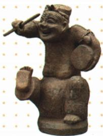
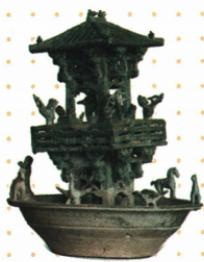

## 讲解

### 判据

两件器物都表现生活，问社会现象时须区分具体内容：说唱俑动作神态对应表演和造型艺术，陶水亭守卫歌娱对应豪强私人武装及娱乐。不能因同属东汉，就把各自原答互换或用一件文物代表全社会。

### 流程

1. 依据原题题注确认器物及材质，不用自动英文猜测改名。
2. 找具体表现：俑的鼓、动作神态，陶亭歌娱与武士守卫；分清观察与结合本课解释。
3. 对应原问社会层面：民间表演生活与豪强田庄生活各答所需；艺术价值可说明俑技艺，私兵说明地方势力。
4. 用原文字与器物说明互证，不仅凭颜色猜材质或凭笑容猜人民普遍生活水平。
5. 限定推论。陶制模型不提供实际建筑高度和兵员总数，单件俑不证明人人欢乐；从侧面反映可以与同阶段社会危机并存。

## 例题

**说唱俑原问与答：**见本课原资料H13-S02，完整如下。

**原资料设问（H13-S02）：**通过图片，说说其折射的东汉社会状况。

**原答案完整保留：**说唱是汉代百戏中的一种。该俑表情生动活泼，幽默风趣，雕塑线条简练，技法娴熟，有很高的艺术价值和欣赏价值，从侧面反映了东汉的民间生活气息和地方风貌。

**完整解析补写：**先看原题题注确定说唱俑，再从动作、表情和持鼓形象联系表演及造型艺术。它从侧面反映社会生活，不是实况照片；不能从俑的笑脸推定东汉所有人生活富裕、没有社会危机。国博[击鼓说唱俑说明](https://www.chnmuseum.cn/zp/zpml/kgfjp/202008/t20200824_247253.shtml)确认其陶俑类别和表演形象，自动描述中的青铜材质、烟斗不采纳。

**原资料设问（H13-S03）：**观察图片，说说其隐含的社会现象。

**原答案：**这一陶水亭是豪强拥有私人武装及娱乐生活的写照。

**完整解析补写：**题注确定绿釉陶水亭，原图中建筑、娱乐与守卫形象，结合本课豪强私人武装说明，支持原答的两个方面。国博[该器物说明](https://www.chnmuseum.cn/zp/zpml/kgfjp/202110/t20211028_251949.shtml)也分别解释歌娱和武士形象。它是表现生活场景的陶制器物，不能把模型当实际楼高、用小人数量统计全部豪强兵员，或从一家豪强生活推出全部农民同样富裕。

## 易错

- 艺术俑原答改成豪强私兵：没有对应特征。
- 陶水亭据小人计全国军队：表现与统计不同。
- 一件文物推出整个朝代无危机：证据范围不足。

### 来源定位

- H13-S02：full.md（历史扫描分册51-100），L300–L314，说唱俑原图、原设问及完整原答；a8d85606-ccac-4ba9-89c2-44c981a45642_origin.pdf，实际PDF第6页。
- H13-S03：full.md（历史扫描分册51-100），L316–L330，绿釉陶水亭原图、原设问与原答；a8d85606-ccac-4ba9-89c2-44c981a45642_origin.pdf，实际PDF第6页。
- H13-S08：full.md（历史扫描分册51-100），L367–L375，豪强土地、田庄、私人武装、地方及朝廷权力；a8d85606-ccac-4ba9-89c2-44c981a45642_origin.pdf，实际PDF第6页。
