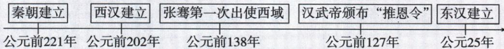

## 讲解

### 判据

年代尺含多个国家建立、出使、地方集权事件，时代主题须同时概括整组。先确定秦汉范围，再解释建立、经营交流、控制地方的共同联系；不能见张骞便将主题只写对外交往，或见秦便改答前一阶段社会转型。

### 流程

1. 逐个对齐原图日期和事件，公元前到公元后的时间顺序先核，不让自动图拆散事件组。
2. 定总体秦汉阶段，避免套隋唐、辽宋夏金元等其他时期本书主题。
3. 分类事件作用：建国体现统一国家建立，推恩体现强化中央控制，出使体现经营和往来。
4. 寻找能包容主要组别的主题统一多民族封建国家建立巩固；单一贸易主题无法覆盖建国和地方制度。
5. 比较选项须看时间与涵盖范围两条件。某选项一般词语可能与单件事有关，但不能据局部相似忽略全组，避免只背章节名而无事实联系。

## 例题

**新考法原题（U3-Q5）：**如图年代尺反映的时代主题是（）。

A. 奴隶制王朝的更替和向封建社会的过渡

B. 统一多民族封建国家的建立和巩固

C. 繁荣与开放的时代

D. 民族关系发展和社会变化

**原答案：B。原解题思路完整保留：**秦朝为我国第一个统一多民族封建国家，两汉巩固大一统，年代尺反映统一多民族封建国家建立和巩固。

**逐项解析补写：**

- A不合题意：属于夏商周到春秋战国社会转型主题；原图主要秦汉国家统一与经营，不能因秦朝前有战国就移用前一时期主题。
- B正确：秦、西汉、东汉建立，张骞出使和推恩分别体现建立统一国家、扩大交往经营、强化中央控制，能概括事件组。
- C不合题意：繁荣开放是本书隋唐主题，时间与事件组合不符；有交流事件不等图已进入隋唐。
- D不合题意：本书辽宋夏金元主题，不能仅因西域民族交往就忽略秦汉主体及其统一治理。

**原图读数核验：**前221年秦建立、前202年西汉建立、前138年张骞首次出使、前127年武帝颁推恩、25年东汉建立。年代尺是按时序连起的事件组，自动图拆为互不相连的日期配对不能代替原图；共同主题需看全部事件，不由一件交流事独断。

## 易错

- 仅一件出使就定全图主题为交流：覆盖不足。
- 所有古代统一都归秦汉不看日期：时代证据缺失。
- 自动日期配对当完整年代尺：图组织信息丢失。

### 来源定位

- U3-Q5：full.md（历史扫描分册51-100），L712–L738，新考法年代尺、四选项、原解题思路和答案B；a8d85606-ccac-4ba9-89c2-44c981a45642_origin.pdf，实际PDF第12页。
