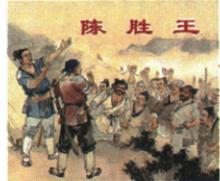

## 讲解

### 判据

看到题目要求“根本原因”“直接原因”，先分长期使反抗可能广泛发生的结构性因素，与导致事件此时此地爆发的具体诱因。秦末起义中，暴政解释不满长期累积，原书遇雨误期的叙述解释触发时机；时间先后不能代替层次判断。

### 流程

1. 提取材料中持续性负担，如赋役、刑罚和思想压制，说明它们怎样影响生计并积累矛盾，而不是仅列名词。
2. 提取一次具体困境，核对人物、地点和情境。原书被征发者遇雨误期属于这层，不把偶然天气当作全部社会矛盾。
3. 建立联系：长期不满使触发事件有反抗基础，具体事件推动行动爆发。若只保留一层，就不能解释为什么不是所有遭雨者都发动同样起义。
4. 按设问给出所需层次。问根本原因答暴政及负担，问直接原因按原书叙述答具体触发；问启示再由统治后果引出以民为本。
5. 对材料可靠性另作核查。原书处罚叙述有研究争议，不将“按原书答题”扩大为已证明所有秦代服役法规。

## 例题

**原资料设问（H10-S02）：**观察图片，说说与此相关的事件和启示。

**原答案：**事件：陈胜、吴广起义。启示：治国之道应以民为本，顺应民心。

**完整解析补写：**先结合原题图题“大泽乡起义”和图中的“陈胜王”辨认事件，不能只凭一群举臂的人就判断任何一场起义。再联系秦的残暴统治使民众生活困难、矛盾激化，从反抗发生的原因接出“以民为本、顺应民心”的启示。图片是表现历史事件的绘画，不能当作秦末现场照片，也不能据画面人数统计起义规模。

**原资料起义表（H10-S04，非另编独立题）：**

|项目|原书内容|
|---|---|
|根本原因|秦的残暴统治|
|直接原因|陈胜、吴广等被征发去渔阳戍守，遇雨误期；原书叙述“在当时，戍守误期要被处死”|
|时间、地点|公元前209年，大泽乡|
|领导者与口号|陈胜、吴广；“王侯将相宁有种乎”|
|政权|攻占陈县后，陈胜称王，建立张楚政权|
|结果|未经过严格军事训练，作战实力有限，内部存在矛盾，缺乏后援，最终失败|
|地位|中国历史上第一次农民大起义|

**史料边界：**“误期要被处死”保留的是原书和传统叙事口径，不能扩展成秦代所有时期、所有徭役或戍役迟到者均一律处死的法律定论。出土秦简与《史记》记述如何对应，涉及律文适用对象和时期，研究仍有不同解释。[研究论文摘要](https://edt.cqvip.com/journal/jgwc/article/1215600391)保留了这一争议。这里不替原书改定论，疑点已在加工记录登记。

## 易错

- 直接原因写“秦暴政”：这回答长期背景而未给具体触发。
- 根本原因只写大雨：天气不能解释长期社会不满。
- 以辨因果层次替代史料核查：两项任务分别完成。

### 来源定位

- H10-S01：full.md（历史扫描分册51-100），L43–L53，秦始皇与秦二世暴政及焚书坑儒原设问、原答；a8d85606-ccac-4ba9-89c2-44c981a45642_origin.pdf，实际PDF第1页。
- H10-S02：full.md（历史扫描分册51-100），L55–L71，大泽乡起义原画及事件、启示原设问；a8d85606-ccac-4ba9-89c2-44c981a45642_origin.pdf，实际PDF第2页。
- H10-S04：full.md（历史扫描分册51-100），L81–L85，陈胜吴广起义原因、过程、结果与地位原表；a8d85606-ccac-4ba9-89c2-44c981a45642_origin.pdf，实际PDF第2页。
