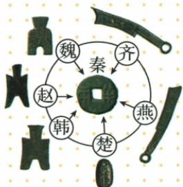

## 讲解

### 判据

题目要求措施、领域或直接作用，先按它改变的对象判断：文字与书面沟通，货币与币制交换，度量衡与数量标准，车轨道路与陆路，灵渠与水路，长城与军事防御。共同总目标是巩固统一，不能替代不同直接功能。

### 流程

1. 识别材料实际对象，如钱币形制、文字标准、河流名称或地方官任免，先确定领域。
2. 说明此前障碍：币制混乱、尺度不同、交通分隔等。理由来自措施要解决的问题，不凭“统一”二字任意配作用。
3. 接出直接效果，再接总目标。例如货币统一便利交换与经济管理，再增强国家联系；不能先写总目标便略去具体机制。
4. 对选项或答题内容逐项核对，排除属于另一政策的效果。交通支持军事是进一步联系，若问直接作用仍应先答交通。
5. 区分当时与后世、形式与全部内容。钱币形制沿用不代表币文币值不变；统一文字不等于人人口语相同。

## 例题

**原资料设问（H9-S03）：**秦始皇下令统一货币在当时产生了什么作用？

**原答案：**货币统一为圆形方孔半两钱有利于国家对经济的管理，促进各地经济的交流。

**完整解析补写：**看到原图不同地域货币集中到同一形制，想到原先币制不同带来的交换和管理困难；统一货币减少货币标准不一致的障碍，使各地交易更便利，也便于政权统一管理经济。此题问货币直接作用，不能用统一车轨的道路作用或长城军事作用代替。图表示标准变化，不是秦攻灭六国的时间或路线。

## 易错

- 货币题写便于文字交流：把两种标准混合。
- 只写巩固统一：未回答材料所问直接作用。
- 将共同形制推出所有价格统一：标准与市场具体状况不是同一结论。

### 来源定位

- H9-S03：full.md（历史扫描分册1-50），L5214–L5274，统一货币原图、设问与原答；22fce0ae-e244-4784-abd1-7e1ac2556947_origin.pdf，实际PDF第50页。
- H9-S06：full.md（历史扫描分册51-100），L1–L5，巩固统一措施与影响完整原表、疆域；a8d85606-ccac-4ba9-89c2-44c981a45642_origin.pdf，实际PDF第1页。
