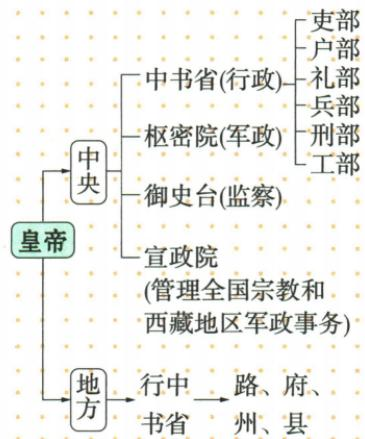

## 错法

看到中书省就一律草拟诏令，或将元地方行中书省当中央。错在用机构字面名称代朝代层级职责；制度会继承名号也改变内容。

## 正解

唐中书属三省分工负责草诏；元中书最高行政、下六部；行中书简称行省为地方最高行政，由临时派出转常设。同名比较需时段职责，少行字又改变层级；元中书直接管部分地区不等中央变地方机构。

## 例题

**原资料（B11-S06、S09，非独立题）：**皇帝之下中央机构中书省掌行政、下六部（吏户礼兵刑工），枢密院掌军政，御史台监察，宣政院管理全国宗教和西藏军政。地方行中书省下列路、府、州、县。

**完整分析补写：**六部接中书省，不接地方行省或枢密院；中央和地方为图的分类，不是另设两个名称叫中央地方的实体官署。图对路府州县概列，不能据水平列字自建每一地区严格同一四级链条。中书在唐负责草诏，元为最高行政机构；名称相同不证明权职相同。皇帝居最上，机构分工属中央集权，不是宣政院接管全部全国军政。

**原资料（B11-S07、S09，非独立题）：**行中书省简称行省，由中书省临时派地方处理事务机构转常设地方最高行政机构。今山东、山西、河北等地直属中书省，原书概称其余全国共10行省。原作用辖区广、军政集中、提高效率，影响是地方行政重大改革、省制开端。

**完整分析补写：**行字原有派出之意，常设后不再只是用完撤的一次任务；中央中书省与地方行中书省不能混。汇集较大区域事务利统筹，同时地方机关仍受中央控制，不能当各省独立国家。省制开端是制度渊源，今日省界、省数和权限不必等元代；原书省数是概览，不等所有年份完全相同。秦郡县与元行省均有地方行政影响，但层级范围和时代不同，不写秦已设元行省。

### 来源定位

- B11-S06：full.md（历史扫描分册51-100），L2848–L2857，中央集权背景、中书六部枢密御史宣政职责；a8d85606-ccac-4ba9-89c2-44c981a45642_origin.pdf，实际PDF第45页。
- B11-S07：full.md（历史扫描分册51-100），L2859–L2861，行省含义由临时到常设、直辖地区、作用影响；a8d85606-ccac-4ba9-89c2-44c981a45642_origin.pdf，实际PDF第45页。
- B11-S09：full.md（历史扫描分册51-100），L2875–L2904，原行政图、自动图与中书省郡县行省两辨析；a8d85606-ccac-4ba9-89c2-44c981a45642_origin.pdf，实际PDF第45页。
